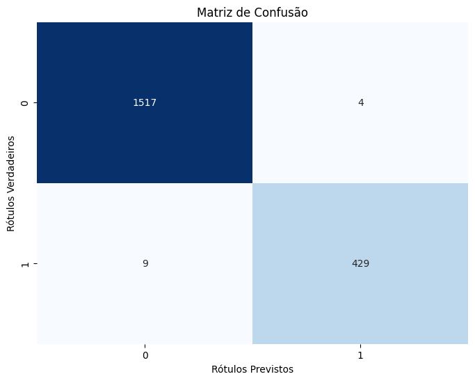
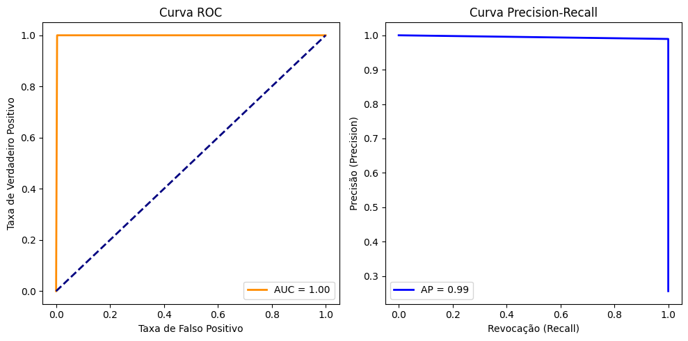
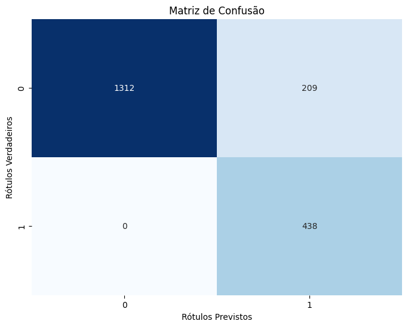
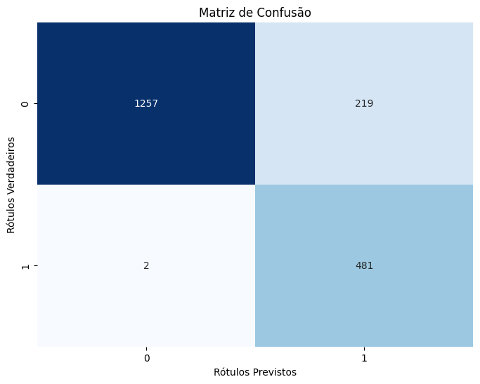
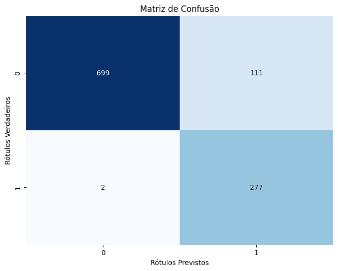
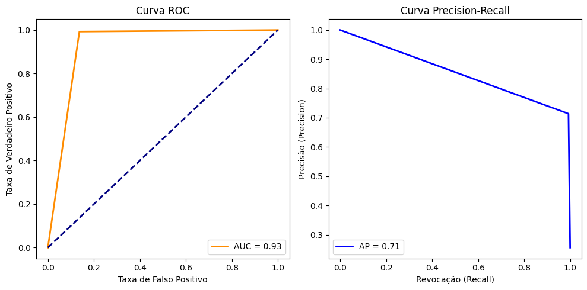
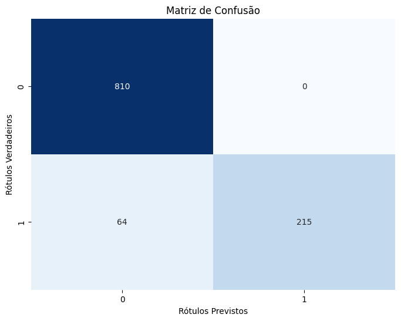

```python
!unzip "/content/bike-sharing-demand.zip"
```

    Archive:  /content/bike-sharing-demand.zip
      inflating: sampleSubmission.csv    
      inflating: test.csv                
      inflating: train.csv               
    


```python
import pandas as pd
import seaborn as sns
import numpy as np
import matplotlib.pyplot as plt

from sklearn.model_selection import train_test_split, cross_val_score, KFold, StratifiedKFold
from sklearn.ensemble import RandomForestRegressor, RandomForestClassifier
from sklearn.metrics import accuracy_score, precision_score, recall_score, f1_score, roc_auc_score
from datetime import datetime

import tensorflow as tf
from tensorflow.keras import Sequential
from tensorflow import keras
from tensorflow.keras.layers import Input, Dense, Conv1D, Flatten
from tensorflow.keras.callbacks import EarlyStopping, ModelCheckpoint
```


```python
df_train = pd.read_csv('train.csv')
df_test = pd.read_csv('test.csv')

df = pd.concat([df_train, df_test])
```

* Data Fields
* datetime - hourly date + timestamp  
* season:
 - 1 = spring
 - 2 = summer
 - 3 = fall
 - 4 = winter
* holiday - whether the day is considered a holiday
* workingday - whether the day is neither a weekend nor holiday
* weather
 - 1: Clear, Few clouds, Partly cloudy, Partly cloudy
 - 2: Mist + Cloudy, Mist + Broken clouds, Mist + Few clouds, Mist
 - 3: Light Snow, Light Rain + Thunderstorm + Scattered clouds, Light Rain + Scattered clouds
 - 4: Heavy Rain + Ice Pallets + Thunderstorm + Mist, Snow + Fog
* temp - temperature in Celsius
* atemp - "feels like" temperature in Celsius
* humidity - relative humidity
* windspeed - wind speed
* casual - number of non-registered user rentals initiated
* registered - number of registered user rentals initiated
* count - number of total rentals


```python
df.head()
```


  <div id="df-8e4efda8-e898-4518-b725-c6178520a03b" class="colab-df-container">
    <div>
<style scoped>
    .dataframe tbody tr th:only-of-type {
        vertical-align: middle;
    }

    .dataframe tbody tr th {
        vertical-align: top;
    }

    .dataframe thead th {
        text-align: right;
    }
</style>
<table border="1" class="dataframe">
  <thead>
    <tr style="text-align: right;">
      <th></th>
      <th>datetime</th>
      <th>season</th>
      <th>holiday</th>
      <th>workingday</th>
      <th>weather</th>
      <th>temp</th>
      <th>atemp</th>
      <th>humidity</th>
      <th>windspeed</th>
      <th>casual</th>
      <th>registered</th>
      <th>count</th>
    </tr>
  </thead>
  <tbody>
    <tr>
      <th>0</th>
      <td>2011-01-01 00:00:00</td>
      <td>1</td>
      <td>0</td>
      <td>0</td>
      <td>1</td>
      <td>9.84</td>
      <td>14.395</td>
      <td>81</td>
      <td>0.0</td>
      <td>3.0</td>
      <td>13.0</td>
      <td>16.0</td>
    </tr>
    <tr>
      <th>1</th>
      <td>2011-01-01 01:00:00</td>
      <td>1</td>
      <td>0</td>
      <td>0</td>
      <td>1</td>
      <td>9.02</td>
      <td>13.635</td>
      <td>80</td>
      <td>0.0</td>
      <td>8.0</td>
      <td>32.0</td>
      <td>40.0</td>
    </tr>
    <tr>
      <th>2</th>
      <td>2011-01-01 02:00:00</td>
      <td>1</td>
      <td>0</td>
      <td>0</td>
      <td>1</td>
      <td>9.02</td>
      <td>13.635</td>
      <td>80</td>
      <td>0.0</td>
      <td>5.0</td>
      <td>27.0</td>
      <td>32.0</td>
    </tr>
    <tr>
      <th>3</th>
      <td>2011-01-01 03:00:00</td>
      <td>1</td>
      <td>0</td>
      <td>0</td>
      <td>1</td>
      <td>9.84</td>
      <td>14.395</td>
      <td>75</td>
      <td>0.0</td>
      <td>3.0</td>
      <td>10.0</td>
      <td>13.0</td>
    </tr>
    <tr>
      <th>4</th>
      <td>2011-01-01 04:00:00</td>
      <td>1</td>
      <td>0</td>
      <td>0</td>
      <td>1</td>
      <td>9.84</td>
      <td>14.395</td>
      <td>75</td>
      <td>0.0</td>
      <td>0.0</td>
      <td>1.0</td>
      <td>1.0</td>
    </tr>
  </tbody>
</table>
</div>
    <div class="colab-df-buttons">

  <div class="colab-df-container">
    <button class="colab-df-convert" onclick="convertToInteractive('df-8e4efda8-e898-4518-b725-c6178520a03b')"
            title="Convert this dataframe to an interactive table."
            style="display:none;">

  <svg xmlns="http://www.w3.org/2000/svg" height="24px" viewBox="0 -960 960 960">
    <path d="M120-120v-720h720v720H120Zm60-500h600v-160H180v160Zm220 220h160v-160H400v160Zm0 220h160v-160H400v160ZM180-400h160v-160H180v160Zm440 0h160v-160H620v160ZM180-180h160v-160H180v160Zm440 0h160v-160H620v160Z"/>
  </svg>
    </button>

  <style>
    .colab-df-container {
      display:flex;
      gap: 12px;
    }

    .colab-df-convert {
      background-color: #E8F0FE;
      border: none;
      border-radius: 50%;
      cursor: pointer;
      display: none;
      fill: #1967D2;
      height: 32px;
      padding: 0 0 0 0;
      width: 32px;
    }

    .colab-df-convert:hover {
      background-color: #E2EBFA;
      box-shadow: 0px 1px 2px rgba(60, 64, 67, 0.3), 0px 1px 3px 1px rgba(60, 64, 67, 0.15);
      fill: #174EA6;
    }

    .colab-df-buttons div {
      margin-bottom: 4px;
    }

    [theme=dark] .colab-df-convert {
      background-color: #3B4455;
      fill: #D2E3FC;
    }

    [theme=dark] .colab-df-convert:hover {
      background-color: #434B5C;
      box-shadow: 0px 1px 3px 1px rgba(0, 0, 0, 0.15);
      filter: drop-shadow(0px 1px 2px rgba(0, 0, 0, 0.3));
      fill: #FFFFFF;
    }
  </style>

    <script>
      const buttonEl =
        document.querySelector('#df-8e4efda8-e898-4518-b725-c6178520a03b button.colab-df-convert');
      buttonEl.style.display =
        google.colab.kernel.accessAllowed ? 'block' : 'none';

      async function convertToInteractive(key) {
        const element = document.querySelector('#df-8e4efda8-e898-4518-b725-c6178520a03b');
        const dataTable =
          await google.colab.kernel.invokeFunction('convertToInteractive',
                                                    [key], {});
        if (!dataTable) return;

        const docLinkHtml = 'Like what you see? Visit the ' +
          '<a target="_blank" href=https://colab.research.google.com/notebooks/data_table.ipynb>data table notebook</a>'
          + ' to learn more about interactive tables.';
        element.innerHTML = '';
        dataTable['output_type'] = 'display_data';
        await google.colab.output.renderOutput(dataTable, element);
        const docLink = document.createElement('div');
        docLink.innerHTML = docLinkHtml;
        element.appendChild(docLink);
      }
    </script>
  </div>


<div id="df-9ae7659e-cd5f-4449-8e02-8028aca63879">
  <button class="colab-df-quickchart" onclick="quickchart('df-9ae7659e-cd5f-4449-8e02-8028aca63879')"
            title="Suggest charts"
            style="display:none;">

<svg xmlns="http://www.w3.org/2000/svg" height="24px"viewBox="0 0 24 24"
     width="24px">
    <g>
        <path d="M19 3H5c-1.1 0-2 .9-2 2v14c0 1.1.9 2 2 2h14c1.1 0 2-.9 2-2V5c0-1.1-.9-2-2-2zM9 17H7v-7h2v7zm4 0h-2V7h2v10zm4 0h-2v-4h2v4z"/>
    </g>
</svg>
  </button>

<style>
  .colab-df-quickchart {
      --bg-color: #E8F0FE;
      --fill-color: #1967D2;
      --hover-bg-color: #E2EBFA;
      --hover-fill-color: #174EA6;
      --disabled-fill-color: #AAA;
      --disabled-bg-color: #DDD;
  }

  [theme=dark] .colab-df-quickchart {
      --bg-color: #3B4455;
      --fill-color: #D2E3FC;
      --hover-bg-color: #434B5C;
      --hover-fill-color: #FFFFFF;
      --disabled-bg-color: #3B4455;
      --disabled-fill-color: #666;
  }

  .colab-df-quickchart {
    background-color: var(--bg-color);
    border: none;
    border-radius: 50%;
    cursor: pointer;
    display: none;
    fill: var(--fill-color);
    height: 32px;
    padding: 0;
    width: 32px;
  }

  .colab-df-quickchart:hover {
    background-color: var(--hover-bg-color);
    box-shadow: 0 1px 2px rgba(60, 64, 67, 0.3), 0 1px 3px 1px rgba(60, 64, 67, 0.15);
    fill: var(--button-hover-fill-color);
  }

  .colab-df-quickchart-complete:disabled,
  .colab-df-quickchart-complete:disabled:hover {
    background-color: var(--disabled-bg-color);
    fill: var(--disabled-fill-color);
    box-shadow: none;
  }

  .colab-df-spinner {
    border: 2px solid var(--fill-color);
    border-color: transparent;
    border-bottom-color: var(--fill-color);
    animation:
      spin 1s steps(1) infinite;
  }

  @keyframes spin {
    0% {
      border-color: transparent;
      border-bottom-color: var(--fill-color);
      border-left-color: var(--fill-color);
    }
    20% {
      border-color: transparent;
      border-left-color: var(--fill-color);
      border-top-color: var(--fill-color);
    }
    30% {
      border-color: transparent;
      border-left-color: var(--fill-color);
      border-top-color: var(--fill-color);
      border-right-color: var(--fill-color);
    }
    40% {
      border-color: transparent;
      border-right-color: var(--fill-color);
      border-top-color: var(--fill-color);
    }
    60% {
      border-color: transparent;
      border-right-color: var(--fill-color);
    }
    80% {
      border-color: transparent;
      border-right-color: var(--fill-color);
      border-bottom-color: var(--fill-color);
    }
    90% {
      border-color: transparent;
      border-bottom-color: var(--fill-color);
    }
  }
</style>

  <script>
    async function quickchart(key) {
      const quickchartButtonEl =
        document.querySelector('#' + key + ' button');
      quickchartButtonEl.disabled = true;  // To prevent multiple clicks.
      quickchartButtonEl.classList.add('colab-df-spinner');
      try {
        const charts = await google.colab.kernel.invokeFunction(
            'suggestCharts', [key], {});
      } catch (error) {
        console.error('Error during call to suggestCharts:', error);
      }
      quickchartButtonEl.classList.remove('colab-df-spinner');
      quickchartButtonEl.classList.add('colab-df-quickchart-complete');
    }
    (() => {
      let quickchartButtonEl =
        document.querySelector('#df-9ae7659e-cd5f-4449-8e02-8028aca63879 button');
      quickchartButtonEl.style.display =
        google.colab.kernel.accessAllowed ? 'block' : 'none';
    })();
  </script>
</div>
    </div>
  </div>


```python
df.describe()
```


  <div id="df-265eef9f-f767-4e7e-a587-2cf58e82239a" class="colab-df-container">
    <div>
<style scoped>
    .dataframe tbody tr th:only-of-type {
        vertical-align: middle;
    }

    .dataframe tbody tr th {
        vertical-align: top;
    }

    .dataframe thead th {
        text-align: right;
    }
</style>
<table border="1" class="dataframe">
  <thead>
    <tr style="text-align: right;">
      <th></th>
      <th>season</th>
      <th>holiday</th>
      <th>workingday</th>
      <th>weather</th>
      <th>temp</th>
      <th>atemp</th>
      <th>humidity</th>
      <th>windspeed</th>
      <th>casual</th>
      <th>registered</th>
      <th>count</th>
    </tr>
  </thead>
  <tbody>
    <tr>
      <th>count</th>
      <td>17379.000000</td>
      <td>17379.000000</td>
      <td>17379.000000</td>
      <td>17379.000000</td>
      <td>17379.000000</td>
      <td>17379.000000</td>
      <td>17379.000000</td>
      <td>17379.000000</td>
      <td>10886.000000</td>
      <td>10886.000000</td>
      <td>10886.000000</td>
    </tr>
    <tr>
      <th>mean</th>
      <td>2.501640</td>
      <td>0.028770</td>
      <td>0.682721</td>
      <td>1.425283</td>
      <td>20.376474</td>
      <td>23.788755</td>
      <td>62.722884</td>
      <td>12.736540</td>
      <td>36.021955</td>
      <td>155.552177</td>
      <td>191.574132</td>
    </tr>
    <tr>
      <th>std</th>
      <td>1.106918</td>
      <td>0.167165</td>
      <td>0.465431</td>
      <td>0.639357</td>
      <td>7.894801</td>
      <td>8.592511</td>
      <td>19.292983</td>
      <td>8.196795</td>
      <td>49.960477</td>
      <td>151.039033</td>
      <td>181.144454</td>
    </tr>
    <tr>
      <th>min</th>
      <td>1.000000</td>
      <td>0.000000</td>
      <td>0.000000</td>
      <td>1.000000</td>
      <td>0.820000</td>
      <td>0.000000</td>
      <td>0.000000</td>
      <td>0.000000</td>
      <td>0.000000</td>
      <td>0.000000</td>
      <td>1.000000</td>
    </tr>
    <tr>
      <th>25%</th>
      <td>2.000000</td>
      <td>0.000000</td>
      <td>0.000000</td>
      <td>1.000000</td>
      <td>13.940000</td>
      <td>16.665000</td>
      <td>48.000000</td>
      <td>7.001500</td>
      <td>4.000000</td>
      <td>36.000000</td>
      <td>42.000000</td>
    </tr>
    <tr>
      <th>50%</th>
      <td>3.000000</td>
      <td>0.000000</td>
      <td>1.000000</td>
      <td>1.000000</td>
      <td>20.500000</td>
      <td>24.240000</td>
      <td>63.000000</td>
      <td>12.998000</td>
      <td>17.000000</td>
      <td>118.000000</td>
      <td>145.000000</td>
    </tr>
    <tr>
      <th>75%</th>
      <td>3.000000</td>
      <td>0.000000</td>
      <td>1.000000</td>
      <td>2.000000</td>
      <td>27.060000</td>
      <td>31.060000</td>
      <td>78.000000</td>
      <td>16.997900</td>
      <td>49.000000</td>
      <td>222.000000</td>
      <td>284.000000</td>
    </tr>
    <tr>
      <th>max</th>
      <td>4.000000</td>
      <td>1.000000</td>
      <td>1.000000</td>
      <td>4.000000</td>
      <td>41.000000</td>
      <td>50.000000</td>
      <td>100.000000</td>
      <td>56.996900</td>
      <td>367.000000</td>
      <td>886.000000</td>
      <td>977.000000</td>
    </tr>
  </tbody>
</table>
</div>
    <div class="colab-df-buttons">

  <div class="colab-df-container">
    <button class="colab-df-convert" onclick="convertToInteractive('df-265eef9f-f767-4e7e-a587-2cf58e82239a')"
            title="Convert this dataframe to an interactive table."
            style="display:none;">

  <svg xmlns="http://www.w3.org/2000/svg" height="24px" viewBox="0 -960 960 960">
    <path d="M120-120v-720h720v720H120Zm60-500h600v-160H180v160Zm220 220h160v-160H400v160Zm0 220h160v-160H400v160ZM180-400h160v-160H180v160Zm440 0h160v-160H620v160ZM180-180h160v-160H180v160Zm440 0h160v-160H620v160Z"/>
  </svg>
    </button>

  <style>
    .colab-df-container {
      display:flex;
      gap: 12px;
    }

    .colab-df-convert {
      background-color: #E8F0FE;
      border: none;
      border-radius: 50%;
      cursor: pointer;
      display: none;
      fill: #1967D2;
      height: 32px;
      padding: 0 0 0 0;
      width: 32px;
    }

    .colab-df-convert:hover {
      background-color: #E2EBFA;
      box-shadow: 0px 1px 2px rgba(60, 64, 67, 0.3), 0px 1px 3px 1px rgba(60, 64, 67, 0.15);
      fill: #174EA6;
    }

    .colab-df-buttons div {
      margin-bottom: 4px;
    }

    [theme=dark] .colab-df-convert {
      background-color: #3B4455;
      fill: #D2E3FC;
    }

    [theme=dark] .colab-df-convert:hover {
      background-color: #434B5C;
      box-shadow: 0px 1px 3px 1px rgba(0, 0, 0, 0.15);
      filter: drop-shadow(0px 1px 2px rgba(0, 0, 0, 0.3));
      fill: #FFFFFF;
    }
  </style>

    <script>
      const buttonEl =
        document.querySelector('#df-265eef9f-f767-4e7e-a587-2cf58e82239a button.colab-df-convert');
      buttonEl.style.display =
        google.colab.kernel.accessAllowed ? 'block' : 'none';

      async function convertToInteractive(key) {
        const element = document.querySelector('#df-265eef9f-f767-4e7e-a587-2cf58e82239a');
        const dataTable =
          await google.colab.kernel.invokeFunction('convertToInteractive',
                                                    [key], {});
        if (!dataTable) return;

        const docLinkHtml = 'Like what you see? Visit the ' +
          '<a target="_blank" href=https://colab.research.google.com/notebooks/data_table.ipynb>data table notebook</a>'
          + ' to learn more about interactive tables.';
        element.innerHTML = '';
        dataTable['output_type'] = 'display_data';
        await google.colab.output.renderOutput(dataTable, element);
        const docLink = document.createElement('div');
        docLink.innerHTML = docLinkHtml;
        element.appendChild(docLink);
      }
    </script>
  </div>


<div id="df-38396880-8269-4924-9449-71a76fb0c6dc">
  <button class="colab-df-quickchart" onclick="quickchart('df-38396880-8269-4924-9449-71a76fb0c6dc')"
            title="Suggest charts"
            style="display:none;">

<svg xmlns="http://www.w3.org/2000/svg" height="24px"viewBox="0 0 24 24"
     width="24px">
    <g>
        <path d="M19 3H5c-1.1 0-2 .9-2 2v14c0 1.1.9 2 2 2h14c1.1 0 2-.9 2-2V5c0-1.1-.9-2-2-2zM9 17H7v-7h2v7zm4 0h-2V7h2v10zm4 0h-2v-4h2v4z"/>
    </g>
</svg>
  </button>

<style>
  .colab-df-quickchart {
      --bg-color: #E8F0FE;
      --fill-color: #1967D2;
      --hover-bg-color: #E2EBFA;
      --hover-fill-color: #174EA6;
      --disabled-fill-color: #AAA;
      --disabled-bg-color: #DDD;
  }

  [theme=dark] .colab-df-quickchart {
      --bg-color: #3B4455;
      --fill-color: #D2E3FC;
      --hover-bg-color: #434B5C;
      --hover-fill-color: #FFFFFF;
      --disabled-bg-color: #3B4455;
      --disabled-fill-color: #666;
  }

  .colab-df-quickchart {
    background-color: var(--bg-color);
    border: none;
    border-radius: 50%;
    cursor: pointer;
    display: none;
    fill: var(--fill-color);
    height: 32px;
    padding: 0;
    width: 32px;
  }

  .colab-df-quickchart:hover {
    background-color: var(--hover-bg-color);
    box-shadow: 0 1px 2px rgba(60, 64, 67, 0.3), 0 1px 3px 1px rgba(60, 64, 67, 0.15);
    fill: var(--button-hover-fill-color);
  }

  .colab-df-quickchart-complete:disabled,
  .colab-df-quickchart-complete:disabled:hover {
    background-color: var(--disabled-bg-color);
    fill: var(--disabled-fill-color);
    box-shadow: none;
  }

  .colab-df-spinner {
    border: 2px solid var(--fill-color);
    border-color: transparent;
    border-bottom-color: var(--fill-color);
    animation:
      spin 1s steps(1) infinite;
  }

  @keyframes spin {
    0% {
      border-color: transparent;
      border-bottom-color: var(--fill-color);
      border-left-color: var(--fill-color);
    }
    20% {
      border-color: transparent;
      border-left-color: var(--fill-color);
      border-top-color: var(--fill-color);
    }
    30% {
      border-color: transparent;
      border-left-color: var(--fill-color);
      border-top-color: var(--fill-color);
      border-right-color: var(--fill-color);
    }
    40% {
      border-color: transparent;
      border-right-color: var(--fill-color);
      border-top-color: var(--fill-color);
    }
    60% {
      border-color: transparent;
      border-right-color: var(--fill-color);
    }
    80% {
      border-color: transparent;
      border-right-color: var(--fill-color);
      border-bottom-color: var(--fill-color);
    }
    90% {
      border-color: transparent;
      border-bottom-color: var(--fill-color);
    }
  }
</style>

  <script>
    async function quickchart(key) {
      const quickchartButtonEl =
        document.querySelector('#' + key + ' button');
      quickchartButtonEl.disabled = true;  // To prevent multiple clicks.
      quickchartButtonEl.classList.add('colab-df-spinner');
      try {
        const charts = await google.colab.kernel.invokeFunction(
            'suggestCharts', [key], {});
      } catch (error) {
        console.error('Error during call to suggestCharts:', error);
      }
      quickchartButtonEl.classList.remove('colab-df-spinner');
      quickchartButtonEl.classList.add('colab-df-quickchart-complete');
    }
    (() => {
      let quickchartButtonEl =
        document.querySelector('#df-38396880-8269-4924-9449-71a76fb0c6dc button');
      quickchartButtonEl.style.display =
        google.colab.kernel.accessAllowed ? 'block' : 'none';
    })();
  </script>
</div>
    </div>
  </div>


```python
df.isnull().sum()
```


    datetime         0
    season           0
    holiday          0
    workingday       0
    weather          0
    temp             0
    atemp            0
    humidity         0
    windspeed        0
    casual        6493
    registered    6493
    count         6493
    dtype: int64


```python
df.shape
```


    (17379, 12)


```python
df = df.dropna()
```


```python
df.isnull().sum()
```


    datetime      0
    season        0
    holiday       0
    workingday    0
    weather       0
    temp          0
    atemp         0
    humidity      0
    windspeed     0
    casual        0
    registered    0
    count         0
    dtype: int64


```python
df_corr = df.corr()
plt.figure(figsize=(14,9))
sns.heatmap(df_corr, annot=True, fmt=".2f")
plt.show()
```

    <ipython-input-10-3a9f600df7ec>:1: FutureWarning: The default value of numeric_only in DataFrame.corr is deprecated. In a future version, it will default to False. Select only valid columns or specify the value of numeric_only to silence this warning.
      df_corr = df.corr()
    


    

    


```python
from sklearn.metrics import confusion_matrix, roc_curve, auc, precision_recall_curve, average_precision_score, mean_squared_error
from sklearn.preprocessing import label_binarize
from itertools import cycle

def generate_matriz_confusion(test_labels, test_predictions_labels):
  cm = confusion_matrix(test_labels, test_predictions_labels)

  plt.figure(figsize=(8, 6))
  sns.heatmap(cm, annot=True, fmt="d", cmap="Blues", cbar=False)
  plt.xlabel("Rótulos Previstos")
  plt.ylabel("Rótulos Verdadeiros")
  plt.title("Matriz de Confusão")
  plt.show()
```


```python
def calcule_metrics_classification(y_test, y_pred):
  accuracy = accuracy_score(y_test, y_pred)
  precision = precision_score(y_test, y_pred)
  recall = recall_score(y_test, y_pred)
  f1 = f1_score(y_test, y_pred)
  roc_auc = roc_auc_score(y_test, y_pred)

  mse = mean_squared_error(y_test, y_pred)
  rmse = np.sqrt(mse)

  print(f"Accuracy: {accuracy}")
  print(f"Precision: {precision}")
  print(f"Recall: {recall}")
  print(f"F1-score: {f1}")
  print(f"ROC AUC: {roc_auc}")
  print(f"MSE: {mse}")
  print(f"RMSE: {rmse}")
```


```python
def plot_auc_ap(y_test, predictions):
  fpr, tpr, _ = roc_curve(y_test, predictions)
  roc_auc = roc_auc_score(y_test, predictions)

  precision, recall, _ = precision_recall_curve(y_test, predictions)
  ap = average_precision_score(y_test, predictions)

  plt.figure(figsize=(10, 5))

  # Curva ROC
  plt.subplot(1, 2, 1)
  plt.plot(fpr, tpr, color='darkorange', lw=2, label=f'AUC = {roc_auc:.2f}')
  plt.plot([0, 1], [0, 1], color='navy', lw=2, linestyle='--')
  plt.xlabel('Taxa de Falso Positivo')
  plt.ylabel('Taxa de Verdadeiro Positivo')
  plt.title('Curva ROC')
  plt.legend(loc='lower right')

  # Curva Precision-Recall
  plt.subplot(1, 2, 2)
  plt.plot(recall, precision, color='blue', lw=2, label=f'AP = {ap:.2f}')
  plt.xlabel('Revocação (Recall)')
  plt.ylabel('Precisão (Precision)')
  plt.title('Curva Precision-Recall')
  plt.legend(loc='lower left')

  plt.tight_layout()
  plt.show()
```


```python
def train_and_metrics(model, X_train, y_train, X_test, y_test):
  all_predictions = []
  all_true_labels = []

  all_accuracy = []
  all_precision = []
  all_recall = []
  all_f1 = []
  all_roc_auc = []

  best_metric_value = -np.inf
  best_model = None

  cv = KFold(n_splits = 5, shuffle=True, random_state = 42)
  for n_folder, (train_index, test_index) in enumerate(cv.split(X_train, y_train)):
      X_train_fold, X_valid = X.iloc[train_index], X.iloc[test_index]
      y_train_fold, y_valid = y.iloc[train_index], y.iloc[test_index]

      model.fit(X_train_fold, y_train_fold)

      predictions = model.predict(X_valid)

      print(f'\nMatriz de confusão para o folder {n_folder}')
      generate_matriz_confusion(y_valid, predictions)

      accuracy = accuracy_score(y_valid, predictions)
      precision = precision_score(y_valid, predictions)
      recall = recall_score(y_valid, predictions)
      f1 = f1_score(y_valid, predictions)
      roc_auc = roc_auc_score(y_valid, predictions)

      print(f"Accuracy: {accuracy}")
      print(f"Precision: {precision}")
      print(f"Recall: {recall}")
      print(f"F1-score: {f1}")
      print(f"ROC AUC: {roc_auc}")

      all_accuracy.append(accuracy)
      all_precision.append(precision)
      all_recall.append(recall)
      all_f1.append(f1)
      all_roc_auc.append(roc_auc)

      if accuracy > best_metric_value:
          best_metric_value = accuracy
          best_model = model

      all_predictions.extend(predictions)
      all_true_labels.extend(y_valid)

  accuracy = accuracy_score(all_true_labels, all_predictions)
  precision = precision_score(all_true_labels, all_predictions)
  recall = recall_score(all_true_labels, all_predictions)
  f1 = f1_score(all_true_labels, all_predictions)
  roc_auc = roc_auc_score(all_true_labels, all_predictions)

  print('\n--------Métricas gerais (média) para a predição dos 5 folders--------:')
  calcule_metrics_classification(all_true_labels, all_predictions)

  predictions = best_model.predict(X_test)
  generate_matriz_confusion(y_test, predictions)
  print('\n--------Cálculo das métricas do melhor modelo--------:')
  calcule_metrics_classification(y_test, predictions)
  print()

  plot_auc_ap(y_test, predictions)
  print()

  return best_model
```

# Processamento dos dados


```python
df['datetime'] = pd.to_datetime(df['datetime'])
df['year'] = df['datetime'].dt.year
df['month'] = df['datetime'].dt.month
df['day'] = df['datetime'].dt.day
df['hour'] = df['datetime'].dt.hour
```


```python
columns = ['season', 'holiday', 'workingday', 'weather', 'temp', 'atemp', 'humidity', 'windspeed', 'year', 'month', 'day', 'hour', 'registered', 'casual']
columns = ['season', 'holiday', 'workingday', 'weather', 'temp', 'atemp', 'humidity', 'windspeed', 'month', 'day', 'hour', 'registered', 'casual']
```


```python
X = df[columns]
y = df['count']
```

# Classificação

> Classificando quando será alugado 150 ou mais bicicletas no dia


```python
df['count'].value_counts()
```


    5.0      169
    4.0      149
    3.0      144
    6.0      135
    2.0      132
            ... 
    801.0      1
    629.0      1
    825.0      1
    589.0      1
    636.0      1
    Name: count, Length: 822, dtype: int64


```python
max(df['count']), min(df['count'])
```


    (977.0, 1.0)


```python
plt.figure(figsize=(12, 6))
plt.plot(df['count'], marker='o', linestyle='-', color='b')
plt.title('Contagem de biciletas alugadas')
plt.xlabel('Índice da Amostra')
plt.ylabel('Count')
plt.grid(True)

plt.show()
```


    

    


```python
plt.figure(figsize=(8,6))
sns.boxplot(data=df['count'], orient="v")
plt.show()
```


    

    


```python
plt.figure(figsize=(8,6))
sns.boxplot(data=df[['temp','atemp']],
            orient='v')
plt.show()
```


    

    


> Queremos construir um modelo que faça a predição se em determinado dia serão alugadas mais de 50% da média de bicicletas: 287 bicicletas


```python
limiar = 287
df['demand_class'] = (df['count'] > limiar).astype(int)

columns_classification = ['season', 'holiday', 'workingday', 'weather', 'temp', 'atemp', 'humidity', 'windspeed', 'month', 'day', 'hour', 'registered', 'casual']
X = df[columns_classification]
y = df['demand_class']
```


```python
df = df.dropna()
```


```python
y.value_counts()
```


    0    8226
    1    2660
    Name: demand_class, dtype: int64


```python
X.isnull().sum()
```


    season        0
    holiday       0
    workingday    0
    weather       0
    temp          0
    atemp         0
    humidity      0
    windspeed     0
    month         0
    day           0
    hour          0
    registered    0
    casual        0
    dtype: int64


```python
X_train, X_test, y_train, y_test = train_test_split(X, y, test_size = 0.10, random_state = 456)
```


```python
from sklearn.preprocessing import MinMaxScaler

scaler = MinMaxScaler(feature_range=(0, 1))
X_train = scaler.fit_transform(X_train)
```

## Random Forest


```python
from sklearn.ensemble import RandomForestClassifier
rf_model = RandomForestClassifier(n_estimators = 100, random_state = 123)
best_rf_model = train_and_metrics(rf_model, X_train, y_train, X_test, y_test)
```

    
    Matriz de confusão para o folder 0
    


    

    


    Accuracy: 0.9954081632653061
    Precision: 0.9883720930232558
    Recall: 0.9906759906759907
    F1-score: 0.9895227008149011
    ROC AUC: 0.9937050756776425
    
    Matriz de confusão para o folder 1
    


    

    


    Accuracy: 0.9928571428571429
    Precision: 0.9935483870967742
    Recall: 0.9767441860465116
    F1-score: 0.9850746268656716
    ROC AUC: 0.9873633505888241
    
    Matriz de confusão para o folder 2
    


    

    


    Accuracy: 0.9933639612046963
    Precision: 0.9907621247113164
    Recall: 0.9794520547945206
    F1-score: 0.9850746268656716
    ROC AUC: 0.9884111030054128
    
    Matriz de confusão para o folder 3
    


    

    


    Accuracy: 0.9928534966819806
    Precision: 0.9815195071868583
    Recall: 0.989648033126294
    F1-score: 0.9855670103092783
    ROC AUC: 0.9917752360753421
    
    Matriz de confusão para o folder 4
    


    

    


    Accuracy: 0.9913221031138336
    Precision: 0.98125
    Recall: 0.9832985386221295
    F1-score: 0.9822732012513035
    ROC AUC: 0.9886087287705243
    
    --------Métricas gerais (média) para a predição dos 5 folders--------:
    Accuracy: 0.9931611717872818
    Precision: 0.9869281045751634
    Recall: 0.9839270199826238
    F1-score: 0.9854252773547966
    ROC AUC: 0.9899621757684965
    MSE: 0.006838828212718179
    RMSE: 0.08269720801041701
    


    

    


    
    --------Cálculo das métricas do melhor modelo--------:
    Accuracy: 0.9972451790633609
    Precision: 0.9893617021276596
    Recall: 1.0
    F1-score: 0.9946524064171123
    ROC AUC: 0.9981481481481482
    MSE: 0.0027548209366391185
    RMSE: 0.0524863881081478
    
    


    

    


    
    

## SVM


```python
from sklearn.svm import SVC
svc_model = SVC(kernel='linear', C = 1.0, random_state = 548)

best_svc_model = train_and_metrics(svc_model, X_train, y_train, X_test, y_test)
```

    
    Matriz de confusão para o folder 0
    


    

    


    Accuracy: 1.0
    Precision: 1.0
    Recall: 1.0
    F1-score: 1.0
    ROC AUC: 1.0
    
    Matriz de confusão para o folder 1
    


    

    


    Accuracy: 1.0
    Precision: 1.0
    Recall: 1.0
    F1-score: 1.0
    ROC AUC: 1.0
    
    Matriz de confusão para o folder 2
    


    

    


    Accuracy: 0.9994895354772844
    Precision: 1.0
    Recall: 0.997716894977169
    F1-score: 0.9988571428571429
    ROC AUC: 0.9988584474885844
    
    Matriz de confusão para o folder 3
    


    

    


    Accuracy: 0.9989790709545686
    Precision: 0.9979296066252588
    Recall: 0.9979296066252588
    F1-score: 0.9979296066252588
    ROC AUC: 0.9986260499250955
    
    Matriz de confusão para o folder 4
    


    

    


    Accuracy: 0.9989790709545686
    Precision: 0.9958419958419958
    Recall: 1.0
    F1-score: 0.9979166666666666
    ROC AUC: 0.9993243243243244
    
    --------Métricas gerais (média) para a predição dos 5 folders--------:
    Accuracy: 0.999489639685618
    Precision: 0.998697351280938
    Recall: 0.9991311902693311
    F1-score: 0.998914223669924
    ROC AUC: 0.9993654617123839
    MSE: 0.0005103603143819537
    RMSE: 0.022591155667250708
    


    

    


    
    --------Cálculo das métricas do melhor modelo--------:
    Accuracy: 1.0
    Precision: 1.0
    Recall: 1.0
    F1-score: 1.0
    ROC AUC: 1.0
    MSE: 0.0
    RMSE: 0.0
    
    


    

    


    
    

## Rede Neural

### Rede Bayesiana


```python
import tensorflow as tf
from tensorflow.keras import Sequential
from tensorflow import keras
from tensorflow.keras.layers import Input, Dense, Conv1D, Flatten
from sklearn.model_selection import StratifiedKFold
from tensorflow.keras.callbacks import EarlyStopping, ModelCheckpoint
```


```python
# from sklearn.preprocessing import StandardScaler
# scaler = StandardScaler()
# X_train_normalized = scaler.fit_transform(X_train)
```


```python
from sklearn.naive_bayes import MultinomialNB
bayes_model = MultinomialNB()

best_bayes_model = train_and_metrics(bayes_model, X_train, y_train, X_test, y_test)
```

    
    Matriz de confusão para o folder 0
    


    

    


    Accuracy: 0.8862244897959184
    Precision: 0.6579754601226994
    Recall: 1.0
    F1-score: 0.793709528214616
    ROC AUC: 0.9271717831482691
    
    Matriz de confusão para o folder 1
    


    

    


    Accuracy: 0.8918367346938776
    Precision: 0.6910688140556369
    Recall: 0.9978858350951374
    F1-score: 0.8166089965397924
    ROC AUC: 0.9279946996592029
    
    Matriz de confusão para o folder 2
    


    

    


    Accuracy: 0.8933129147524247
    Precision: 0.6769706336939721
    Recall: 1.0
    F1-score: 0.8073732718894009
    ROC AUC: 0.9312952005259698
    
    Matriz de confusão para o folder 3
    


    

    


    Accuracy: 0.8871873404798366
    Precision: 0.6871428571428572
    Recall: 0.9958592132505176
    F1-score: 0.8131868131868132
    ROC AUC: 0.92374261475534
    
    Matriz de confusão para o folder 4
    


    

    


    Accuracy: 0.8836140888208269
    Precision: 0.6790299572039943
    Recall: 0.9937369519832986
    F1-score: 0.8067796610169492
    ROC AUC: 0.9208549624781358
    
    --------Métricas gerais (média) para a predição dos 5 folders--------:
    Accuracy: 0.8884352352761049
    Precision: 0.6786875554241797
    Recall: 0.9973935708079931
    F1-score: 0.8077396657871593
    ROC AUC: 0.9261817753973254
    MSE: 0.11156476472389507
    RMSE: 0.334013120586445
    


    

    


    
    --------Cálculo das métricas do melhor modelo--------:
    Accuracy: 0.8962350780532599
    Precision: 0.7139175257731959
    Recall: 0.992831541218638
    F1-score: 0.830584707646177
    ROC AUC: 0.9278972520908005
    MSE: 0.10376492194674013
    RMSE: 0.32212563068892874
    
    


    

    


    
    


```python
# scaler = StandardScaler()
# X_train_normalized = scaler.fit_transform(X_train)
```


```python
# X_train_normalized.shape
```


```python
y_train
```


    10805    1
    133      0
    3815     0
    6739     0
    10507    0
            ..
    9116     0
    10735    1
    6186     0
    10841    0
    613      0
    Name: demand_class, Length: 9797, dtype: int64


### Convolucional


```python
early_stopping = EarlyStopping(monitor='val_loss', patience=5, restore_best_weights=True)
```


```python
X_train = X_train.reshape(X_train.shape[0], X_train.shape[1], 1)
X_train.shape
```


    (9797, 13, 1)


```python
name_checkpoint_best_model = 'best_model.h5'
```


```python
X_train.shape, y_train.shape
```


    ((9797, 13, 1), (9797,))


```python
!pip install tensorflow_addons

import tensorflow_addons as tfa
from keras import backend as K

def root_mean_squared_error(y_true, y_pred):
  return K.sqrt(K.mean(K.square(y_pred - y_true)))

def recall(y_true, y_pred):
    true_positives = K.sum(K.round(K.clip(y_true * y_pred, 0, 1))) # soma dos verdadeiros positivos
    possible_positives = K.sum(K.round(K.clip(y_true, 0, 1))) # soma dos verdadeiros positivos + falsos negativos
    recall = true_positives / (possible_positives + K.epsilon()) # cálculo do recall
    return recall

def specificity(y_true, y_pred):
    true_negatives = K.sum(K.round(K.clip((1-y_true) * (1-y_pred), 0, 1))) # soma dos verdadeiros negativos
    possible_negatives = K.sum(K.round(K.clip(1-y_true, 0, 1))) # soma dos verdadeiros negativos + falsos positivos
    specificity = true_negatives / (possible_negatives + K.epsilon()) # cálculo da especificidade
    return specificity
```

    Requirement already satisfied: tensorflow_addons in /usr/local/lib/python3.10/dist-packages (0.23.0)
    Requirement already satisfied: packaging in /usr/local/lib/python3.10/dist-packages (from tensorflow_addons) (23.2)
    Requirement already satisfied: typeguard<3.0.0,>=2.7 in /usr/local/lib/python3.10/dist-packages (from tensorflow_addons) (2.13.3)
    


```python
X_train.shape
```


    (9797, 13, 1)


```python
cv = StratifiedKFold(n_splits=5, shuffle=True, random_state = 789)
accuracies = []

# for train_index, test_index in cv.split(X_train, y_train):
#     X_train_neural, X_test_neural = X_train[train_index], X_train[test_index]
#     y_train_neural, y_test_neural = y_train.iloc[train_index], y_train.iloc[test_index]
for n_folder, (train_index, test_index) in enumerate(cv.split(X_train, y_train)):
    X_train_neural, X_test_neural = X_train[train_index], X_train[test_index]
    y_train_neural, y_test_neural = y_train.iloc[train_index], y_train.iloc[test_index]

    model_checkpoint = ModelCheckpoint(name_checkpoint_best_model, monitor='val_accuracy', save_best_only=True, mode='max', verbose=1)

    model = Sequential([
        Input(shape=(X_train.shape[1], X_train.shape[2], )),
        Conv1D(64, 3, activation='relu'),
        Flatten(),
        Dense(64, activation='relu'),
        Dense(32, activation='relu'),
        Dense(1, activation='sigmoid')
    ])

    model.compile(optimizer='adam', loss='binary_crossentropy',
                      metrics = [ tf.keras.metrics.MeanAbsoluteError(name='mae'),
                                  tf.keras.metrics.CategoricalAccuracy(name='accuracy', dtype=None),
                                  tf.keras.metrics.Recall(name='Recall'),
                                  tf.keras.metrics.Precision(name='Precision'),
                                  tf.keras.metrics.SpecificityAtSensitivity(name='Specificity', sensitivity = 0.5),
                                  tf.keras.metrics.AUC(curve="ROC", summation_method="interpolation", name="AUC")
                                  ])

    model.fit(X_train_neural, y_train_neural, epochs = 20, batch_size = 32,
              validation_data=(X_test_neural, y_test_neural), callbacks=[early_stopping, model_checkpoint], verbose=1 )
    my_tensor = tf.convert_to_tensor(X_test_neural, dtype=tf.float16)
    previsoes = model.predict(my_tensor)

    y_pred_classes = (previsoes > 0.9)
    y_val_classes = np.round(y_test_neural)
    generate_matriz_confusion(y_val_classes, y_pred_classes)
    calcule_metrics_classification(y_val_classes, y_pred_classes)
```

    Epoch 1/20
    244/245 [============================>.] - ETA: 0s - loss: 0.2371 - mae: 0.1699 - accuracy: 1.0000 - Recall: 0.6507 - Precision: 0.9204 - Specificity: 0.9981 - AUC: 0.9551
    Epoch 1: val_accuracy improved from -inf to 1.00000, saving model to best_model.h5
    245/245 [==============================] - 4s 8ms/step - loss: 0.2365 - mae: 0.1695 - accuracy: 1.0000 - Recall: 0.6513 - Precision: 0.9206 - Specificity: 0.9981 - AUC: 0.9552 - val_loss: 0.0691 - val_mae: 0.0540 - val_accuracy: 1.0000 - val_Recall: 0.9161 - val_Precision: 0.9932 - val_Specificity: 1.0000 - val_AUC: 0.9984
    Epoch 2/20
     36/245 [===>..........................] - ETA: 0s - loss: 0.0696 - mae: 0.0528 - accuracy: 1.0000 - Recall: 0.9386 - Precision: 0.9594 - Specificity: 1.0000 - AUC: 0.9973

    /usr/local/lib/python3.10/dist-packages/keras/src/engine/training.py:3079: UserWarning: You are saving your model as an HDF5 file via `model.save()`. This file format is considered legacy. We recommend using instead the native Keras format, e.g. `model.save('my_model.keras')`.
      saving_api.save_model(
    

    245/245 [==============================] - ETA: 0s - loss: 0.0574 - mae: 0.0430 - accuracy: 1.0000 - Recall: 0.9512 - Precision: 0.9638 - Specificity: 1.0000 - AUC: 0.9980
    Epoch 2: val_accuracy did not improve from 1.00000
    245/245 [==============================] - 2s 8ms/step - loss: 0.0574 - mae: 0.0430 - accuracy: 1.0000 - Recall: 0.9512 - Precision: 0.9638 - Specificity: 1.0000 - AUC: 0.9980 - val_loss: 0.0441 - val_mae: 0.0345 - val_accuracy: 1.0000 - val_Recall: 0.9539 - val_Precision: 0.9764 - val_Specificity: 1.0000 - val_AUC: 0.9992
    Epoch 3/20
    244/245 [============================>.] - ETA: 0s - loss: 0.0421 - mae: 0.0302 - accuracy: 1.0000 - Recall: 0.9583 - Precision: 0.9664 - Specificity: 1.0000 - AUC: 0.9987
    Epoch 3: val_accuracy did not improve from 1.00000
    245/245 [==============================] - 2s 10ms/step - loss: 0.0425 - mae: 0.0304 - accuracy: 1.0000 - Recall: 0.9585 - Precision: 0.9656 - Specificity: 1.0000 - AUC: 0.9987 - val_loss: 0.0890 - val_mae: 0.0490 - val_accuracy: 1.0000 - val_Recall: 1.0000 - val_Precision: 0.8457 - val_Specificity: 1.0000 - val_AUC: 0.9996
    Epoch 4/20
    242/245 [============================>.] - ETA: 0s - loss: 0.0374 - mae: 0.0250 - accuracy: 1.0000 - Recall: 0.9655 - Precision: 0.9717 - Specificity: 1.0000 - AUC: 0.9989
    Epoch 4: val_accuracy did not improve from 1.00000
    245/245 [==============================] - 3s 14ms/step - loss: 0.0374 - mae: 0.0250 - accuracy: 1.0000 - Recall: 0.9659 - Precision: 0.9710 - Specificity: 1.0000 - AUC: 0.9989 - val_loss: 0.0645 - val_mae: 0.0375 - val_accuracy: 1.0000 - val_Recall: 1.0000 - val_Precision: 0.8817 - val_Specificity: 1.0000 - val_AUC: 0.9995
    Epoch 5/20
    240/245 [============================>.] - ETA: 0s - loss: 0.0454 - mae: 0.0268 - accuracy: 1.0000 - Recall: 0.9576 - Precision: 0.9581 - Specificity: 1.0000 - AUC: 0.9983
    Epoch 5: val_accuracy did not improve from 1.00000
    245/245 [==============================] - 3s 12ms/step - loss: 0.0448 - mae: 0.0265 - accuracy: 1.0000 - Recall: 0.9585 - Precision: 0.9590 - Specificity: 1.0000 - AUC: 0.9984 - val_loss: 0.0288 - val_mae: 0.0225 - val_accuracy: 1.0000 - val_Recall: 0.9748 - val_Precision: 0.9894 - val_Specificity: 1.0000 - val_AUC: 0.9996
    Epoch 6/20
    244/245 [============================>.] - ETA: 0s - loss: 0.0299 - mae: 0.0204 - accuracy: 1.0000 - Recall: 0.9725 - Precision: 0.9746 - Specificity: 1.0000 - AUC: 0.9991
    Epoch 6: val_accuracy did not improve from 1.00000
    245/245 [==============================] - 2s 9ms/step - loss: 0.0308 - mae: 0.0206 - accuracy: 1.0000 - Recall: 0.9716 - Precision: 0.9747 - Specificity: 1.0000 - AUC: 0.9990 - val_loss: 0.0857 - val_mae: 0.0339 - val_accuracy: 1.0000 - val_Recall: 0.8553 - val_Precision: 1.0000 - val_Specificity: 1.0000 - val_AUC: 0.9974
    Epoch 7/20
    241/245 [============================>.] - ETA: 0s - loss: 0.0293 - mae: 0.0198 - accuracy: 1.0000 - Recall: 0.9718 - Precision: 0.9765 - Specificity: 1.0000 - AUC: 0.9993
    Epoch 7: val_accuracy did not improve from 1.00000
    245/245 [==============================] - 3s 11ms/step - loss: 0.0290 - mae: 0.0196 - accuracy: 1.0000 - Recall: 0.9722 - Precision: 0.9768 - Specificity: 1.0000 - AUC: 0.9993 - val_loss: 0.0384 - val_mae: 0.0244 - val_accuracy: 1.0000 - val_Recall: 1.0000 - val_Precision: 0.9226 - val_Specificity: 1.0000 - val_AUC: 0.9997
    Epoch 8/20
    243/245 [============================>.] - ETA: 0s - loss: 0.0314 - mae: 0.0194 - accuracy: 1.0000 - Recall: 0.9740 - Precision: 0.9730 - Specificity: 1.0000 - AUC: 0.9992
    Epoch 8: val_accuracy did not improve from 1.00000
    245/245 [==============================] - 2s 9ms/step - loss: 0.0313 - mae: 0.0194 - accuracy: 1.0000 - Recall: 0.9743 - Precision: 0.9732 - Specificity: 1.0000 - AUC: 0.9992 - val_loss: 0.0306 - val_mae: 0.0195 - val_accuracy: 1.0000 - val_Recall: 0.9455 - val_Precision: 1.0000 - val_Specificity: 1.0000 - val_AUC: 0.9997
    Epoch 9/20
    243/245 [============================>.] - ETA: 0s - loss: 0.0295 - mae: 0.0176 - accuracy: 1.0000 - Recall: 0.9757 - Precision: 0.9798 - Specificity: 1.0000 - AUC: 0.9993
    Epoch 9: val_accuracy did not improve from 1.00000
    245/245 [==============================] - 3s 13ms/step - loss: 0.0295 - mae: 0.0176 - accuracy: 1.0000 - Recall: 0.9758 - Precision: 0.9794 - Specificity: 1.0000 - AUC: 0.9993 - val_loss: 0.0324 - val_mae: 0.0213 - val_accuracy: 1.0000 - val_Recall: 1.0000 - val_Precision: 0.9353 - val_Specificity: 1.0000 - val_AUC: 0.9998
    Epoch 10/20
    244/245 [============================>.] - ETA: 0s - loss: 0.0223 - mae: 0.0147 - accuracy: 1.0000 - Recall: 0.9789 - Precision: 0.9862 - Specificity: 1.0000 - AUC: 0.9996
    Epoch 10: val_accuracy did not improve from 1.00000
    245/245 [==============================] - 4s 15ms/step - loss: 0.0223 - mae: 0.0147 - accuracy: 1.0000 - Recall: 0.9790 - Precision: 0.9862 - Specificity: 1.0000 - AUC: 0.9996 - val_loss: 0.0247 - val_mae: 0.0166 - val_accuracy: 1.0000 - val_Recall: 0.9539 - val_Precision: 0.9978 - val_Specificity: 1.0000 - val_AUC: 0.9999
    Epoch 11/20
    245/245 [==============================] - ETA: 0s - loss: 0.0188 - mae: 0.0132 - accuracy: 1.0000 - Recall: 0.9869 - Precision: 0.9889 - Specificity: 1.0000 - AUC: 0.9997
    Epoch 11: val_accuracy did not improve from 1.00000
    245/245 [==============================] - 2s 9ms/step - loss: 0.0188 - mae: 0.0132 - accuracy: 1.0000 - Recall: 0.9869 - Precision: 0.9889 - Specificity: 1.0000 - AUC: 0.9997 - val_loss: 0.0219 - val_mae: 0.0144 - val_accuracy: 1.0000 - val_Recall: 0.9581 - val_Precision: 1.0000 - val_Specificity: 1.0000 - val_AUC: 0.9999
    Epoch 12/20
    244/245 [============================>.] - ETA: 0s - loss: 0.0227 - mae: 0.0137 - accuracy: 1.0000 - Recall: 0.9810 - Precision: 0.9831 - Specificity: 1.0000 - AUC: 0.9996
    Epoch 12: val_accuracy did not improve from 1.00000
    245/245 [==============================] - 2s 8ms/step - loss: 0.0226 - mae: 0.0137 - accuracy: 1.0000 - Recall: 0.9811 - Precision: 0.9832 - Specificity: 1.0000 - AUC: 0.9996 - val_loss: 0.0210 - val_mae: 0.0150 - val_accuracy: 1.0000 - val_Recall: 0.9644 - val_Precision: 0.9892 - val_Specificity: 1.0000 - val_AUC: 0.9997
    Epoch 13/20
    241/245 [============================>.] - ETA: 0s - loss: 0.0182 - mae: 0.0121 - accuracy: 1.0000 - Recall: 0.9829 - Precision: 0.9871 - Specificity: 1.0000 - AUC: 0.9997
    Epoch 13: val_accuracy did not improve from 1.00000
    245/245 [==============================] - 3s 12ms/step - loss: 0.0181 - mae: 0.0121 - accuracy: 1.0000 - Recall: 0.9832 - Precision: 0.9868 - Specificity: 1.0000 - AUC: 0.9997 - val_loss: 0.0194 - val_mae: 0.0134 - val_accuracy: 1.0000 - val_Recall: 0.9748 - val_Precision: 0.9894 - val_Specificity: 1.0000 - val_AUC: 0.9997
    Epoch 14/20
    242/245 [============================>.] - ETA: 0s - loss: 0.0320 - mae: 0.0155 - accuracy: 1.0000 - Recall: 0.9766 - Precision: 0.9761 - Specificity: 0.9997 - AUC: 0.9984
    Epoch 14: val_accuracy did not improve from 1.00000
    245/245 [==============================] - 3s 11ms/step - loss: 0.0324 - mae: 0.0156 - accuracy: 1.0000 - Recall: 0.9758 - Precision: 0.9764 - Specificity: 0.9997 - AUC: 0.9984 - val_loss: 0.0453 - val_mae: 0.0214 - val_accuracy: 1.0000 - val_Recall: 0.9266 - val_Precision: 0.9955 - val_Specificity: 1.0000 - val_AUC: 0.9994
    Epoch 15/20
    244/245 [============================>.] - ETA: 0s - loss: 0.0217 - mae: 0.0143 - accuracy: 1.0000 - Recall: 0.9805 - Precision: 0.9825 - Specificity: 1.0000 - AUC: 0.9996
    Epoch 15: val_accuracy did not improve from 1.00000
    245/245 [==============================] - 5s 19ms/step - loss: 0.0216 - mae: 0.0143 - accuracy: 1.0000 - Recall: 0.9806 - Precision: 0.9826 - Specificity: 1.0000 - AUC: 0.9996 - val_loss: 0.0313 - val_mae: 0.0170 - val_accuracy: 1.0000 - val_Recall: 0.9371 - val_Precision: 1.0000 - val_Specificity: 1.0000 - val_AUC: 0.9998
    Epoch 16/20
    237/245 [============================>.] - ETA: 0s - loss: 0.0238 - mae: 0.0139 - accuracy: 1.0000 - Recall: 0.9777 - Precision: 0.9803 - Specificity: 1.0000 - AUC: 0.9995
    Epoch 16: val_accuracy did not improve from 1.00000
    245/245 [==============================] - 1s 6ms/step - loss: 0.0236 - mae: 0.0139 - accuracy: 1.0000 - Recall: 0.9779 - Precision: 0.9810 - Specificity: 1.0000 - AUC: 0.9995 - val_loss: 0.0187 - val_mae: 0.0140 - val_accuracy: 1.0000 - val_Recall: 0.9979 - val_Precision: 0.9754 - val_Specificity: 1.0000 - val_AUC: 0.9999
    Epoch 17/20
    235/245 [===========================>..] - ETA: 0s - loss: 0.0255 - mae: 0.0145 - accuracy: 1.0000 - Recall: 0.9749 - Precision: 0.9808 - Specificity: 1.0000 - AUC: 0.9990
    Epoch 17: val_accuracy did not improve from 1.00000
    245/245 [==============================] - 1s 5ms/step - loss: 0.0249 - mae: 0.0143 - accuracy: 1.0000 - Recall: 0.9758 - Precision: 0.9810 - Specificity: 1.0000 - AUC: 0.9990 - val_loss: 0.0283 - val_mae: 0.0167 - val_accuracy: 1.0000 - val_Recall: 0.9686 - val_Precision: 0.9809 - val_Specificity: 1.0000 - val_AUC: 0.9994
    Epoch 18/20
    239/245 [============================>.] - ETA: 0s - loss: 0.0241 - mae: 0.0140 - accuracy: 1.0000 - Recall: 0.9757 - Precision: 0.9832 - Specificity: 1.0000 - AUC: 0.9995
    Epoch 18: val_accuracy did not improve from 1.00000
    245/245 [==============================] - 1s 5ms/step - loss: 0.0238 - mae: 0.0139 - accuracy: 1.0000 - Recall: 0.9764 - Precision: 0.9836 - Specificity: 1.0000 - AUC: 0.9995 - val_loss: 0.0175 - val_mae: 0.0131 - val_accuracy: 1.0000 - val_Recall: 0.9748 - val_Precision: 0.9936 - val_Specificity: 1.0000 - val_AUC: 0.9999
    Epoch 19/20
    236/245 [===========================>..] - ETA: 0s - loss: 0.0209 - mae: 0.0122 - accuracy: 1.0000 - Recall: 0.9832 - Precision: 0.9869 - Specificity: 1.0000 - AUC: 0.9996
    Epoch 19: val_accuracy did not improve from 1.00000
    245/245 [==============================] - 1s 5ms/step - loss: 0.0206 - mae: 0.0120 - accuracy: 1.0000 - Recall: 0.9837 - Precision: 0.9868 - Specificity: 1.0000 - AUC: 0.9996 - val_loss: 0.0277 - val_mae: 0.0149 - val_accuracy: 1.0000 - val_Recall: 0.9518 - val_Precision: 0.9978 - val_Specificity: 1.0000 - val_AUC: 0.9997
    Epoch 20/20
    243/245 [============================>.] - ETA: 0s - loss: 0.0154 - mae: 0.0102 - accuracy: 1.0000 - Recall: 0.9868 - Precision: 0.9894 - Specificity: 1.0000 - AUC: 0.9998
    Epoch 20: val_accuracy did not improve from 1.00000
    245/245 [==============================] - 1s 5ms/step - loss: 0.0154 - mae: 0.0102 - accuracy: 1.0000 - Recall: 0.9863 - Precision: 0.9895 - Specificity: 1.0000 - AUC: 0.9998 - val_loss: 0.0225 - val_mae: 0.0131 - val_accuracy: 1.0000 - val_Recall: 0.9602 - val_Precision: 1.0000 - val_Specificity: 1.0000 - val_AUC: 0.9998
    62/62 [==============================] - 0s 2ms/step
    


    

    


    Accuracy: 0.9795918367346939
    Precision: 1.0
    Recall: 0.9161425576519916
    F1-score: 0.9562363238512035
    ROC AUC: 0.9580712788259957
    MSE: 0.02040816326530612
    RMSE: 0.14285714285714285
    Epoch 1/20
    241/245 [============================>.] - ETA: 0s - loss: 0.2369 - mae: 0.1696 - accuracy: 1.0000 - Recall: 0.6510 - Precision: 0.9278 - Specificity: 0.9969 - AUC: 0.9551
    Epoch 1: val_accuracy improved from -inf to 1.00000, saving model to best_model.h5
    245/245 [==============================] - 3s 6ms/step - loss: 0.2345 - mae: 0.1678 - accuracy: 1.0000 - Recall: 0.6551 - Precision: 0.9293 - Specificity: 0.9971 - AUC: 0.9561 - val_loss: 0.0644 - val_mae: 0.0518 - val_accuracy: 1.0000 - val_Recall: 0.9622 - val_Precision: 0.9642 - val_Specificity: 1.0000 - val_AUC: 0.9986
    Epoch 2/20
     40/245 [===>..........................] - ETA: 0s - loss: 0.0735 - mae: 0.0550 - accuracy: 1.0000 - Recall: 0.9331 - Precision: 0.9490 - Specificity: 1.0000 - AUC: 0.9966

    /usr/local/lib/python3.10/dist-packages/keras/src/engine/training.py:3079: UserWarning: You are saving your model as an HDF5 file via `model.save()`. This file format is considered legacy. We recommend using instead the native Keras format, e.g. `model.save('my_model.keras')`.
      saving_api.save_model(
    

    242/245 [============================>.] - ETA: 0s - loss: 0.0651 - mae: 0.0476 - accuracy: 1.0000 - Recall: 0.9347 - Precision: 0.9550 - Specificity: 1.0000 - AUC: 0.9972
    Epoch 2: val_accuracy did not improve from 1.00000
    245/245 [==============================] - 1s 5ms/step - loss: 0.0646 - mae: 0.0473 - accuracy: 1.0000 - Recall: 0.9354 - Precision: 0.9555 - Specificity: 1.0000 - AUC: 0.9972 - val_loss: 0.0519 - val_mae: 0.0383 - val_accuracy: 1.0000 - val_Recall: 0.9958 - val_Precision: 0.9368 - val_Specificity: 1.0000 - val_AUC: 0.9993
    Epoch 3/20
    242/245 [============================>.] - ETA: 0s - loss: 0.0406 - mae: 0.0310 - accuracy: 1.0000 - Recall: 0.9645 - Precision: 0.9681 - Specificity: 1.0000 - AUC: 0.9991
    Epoch 3: val_accuracy did not improve from 1.00000
    245/245 [==============================] - 1s 5ms/step - loss: 0.0405 - mae: 0.0308 - accuracy: 1.0000 - Recall: 0.9643 - Precision: 0.9684 - Specificity: 1.0000 - AUC: 0.9991 - val_loss: 0.0462 - val_mae: 0.0297 - val_accuracy: 1.0000 - val_Recall: 0.9076 - val_Precision: 1.0000 - val_Specificity: 1.0000 - val_AUC: 0.9995
    Epoch 4/20
    245/245 [==============================] - ETA: 0s - loss: 0.0377 - mae: 0.0262 - accuracy: 1.0000 - Recall: 0.9654 - Precision: 0.9725 - Specificity: 1.0000 - AUC: 0.9989
    Epoch 4: val_accuracy did not improve from 1.00000
    245/245 [==============================] - 1s 6ms/step - loss: 0.0377 - mae: 0.0262 - accuracy: 1.0000 - Recall: 0.9654 - Precision: 0.9725 - Specificity: 1.0000 - AUC: 0.9989 - val_loss: 0.0501 - val_mae: 0.0282 - val_accuracy: 1.0000 - val_Recall: 0.8971 - val_Precision: 1.0000 - val_Specificity: 1.0000 - val_AUC: 0.9997
    Epoch 5/20
    238/245 [============================>.] - ETA: 0s - loss: 0.0367 - mae: 0.0242 - accuracy: 1.0000 - Recall: 0.9664 - Precision: 0.9712 - Specificity: 1.0000 - AUC: 0.9989
    Epoch 5: val_accuracy did not improve from 1.00000
    245/245 [==============================] - 2s 7ms/step - loss: 0.0362 - mae: 0.0240 - accuracy: 1.0000 - Recall: 0.9675 - Precision: 0.9715 - Specificity: 1.0000 - AUC: 0.9990 - val_loss: 0.0286 - val_mae: 0.0201 - val_accuracy: 1.0000 - val_Recall: 0.9454 - val_Precision: 0.9956 - val_Specificity: 1.0000 - val_AUC: 0.9997
    Epoch 6/20
    238/245 [============================>.] - ETA: 0s - loss: 0.0290 - mae: 0.0205 - accuracy: 1.0000 - Recall: 0.9725 - Precision: 0.9793 - Specificity: 1.0000 - AUC: 0.9994
    Epoch 6: val_accuracy did not improve from 1.00000
    245/245 [==============================] - 2s 7ms/step - loss: 0.0285 - mae: 0.0202 - accuracy: 1.0000 - Recall: 0.9722 - Precision: 0.9799 - Specificity: 1.0000 - AUC: 0.9994 - val_loss: 0.0238 - val_mae: 0.0176 - val_accuracy: 1.0000 - val_Recall: 1.0000 - val_Precision: 0.9577 - val_Specificity: 1.0000 - val_AUC: 0.9999
    Epoch 7/20
    236/245 [===========================>..] - ETA: 0s - loss: 0.0465 - mae: 0.0258 - accuracy: 1.0000 - Recall: 0.9554 - Precision: 0.9559 - Specificity: 1.0000 - AUC: 0.9978
    Epoch 7: val_accuracy did not improve from 1.00000
    245/245 [==============================] - 1s 5ms/step - loss: 0.0460 - mae: 0.0256 - accuracy: 1.0000 - Recall: 0.9559 - Precision: 0.9574 - Specificity: 1.0000 - AUC: 0.9979 - val_loss: 0.0311 - val_mae: 0.0209 - val_accuracy: 1.0000 - val_Recall: 0.9979 - val_Precision: 0.9425 - val_Specificity: 1.0000 - val_AUC: 0.9998
    Epoch 8/20
    236/245 [===========================>..] - ETA: 0s - loss: 0.0263 - mae: 0.0184 - accuracy: 1.0000 - Recall: 0.9745 - Precision: 0.9761 - Specificity: 1.0000 - AUC: 0.9995
    Epoch 8: val_accuracy did not improve from 1.00000
    245/245 [==============================] - 1s 5ms/step - loss: 0.0257 - mae: 0.0181 - accuracy: 1.0000 - Recall: 0.9753 - Precision: 0.9769 - Specificity: 1.0000 - AUC: 0.9995 - val_loss: 0.0186 - val_mae: 0.0146 - val_accuracy: 1.0000 - val_Recall: 0.9811 - val_Precision: 0.9957 - val_Specificity: 1.0000 - val_AUC: 0.9999
    Epoch 9/20
    242/245 [============================>.] - ETA: 0s - loss: 0.0227 - mae: 0.0160 - accuracy: 1.0000 - Recall: 0.9767 - Precision: 0.9834 - Specificity: 1.0000 - AUC: 0.9996
    Epoch 9: val_accuracy did not improve from 1.00000
    245/245 [==============================] - 1s 5ms/step - loss: 0.0225 - mae: 0.0159 - accuracy: 1.0000 - Recall: 0.9769 - Precision: 0.9836 - Specificity: 1.0000 - AUC: 0.9996 - val_loss: 0.0194 - val_mae: 0.0139 - val_accuracy: 1.0000 - val_Recall: 0.9664 - val_Precision: 0.9957 - val_Specificity: 1.0000 - val_AUC: 0.9998
    Epoch 10/20
    241/245 [============================>.] - ETA: 0s - loss: 0.0267 - mae: 0.0164 - accuracy: 1.0000 - Recall: 0.9754 - Precision: 0.9775 - Specificity: 1.0000 - AUC: 0.9994
    Epoch 10: val_accuracy did not improve from 1.00000
    245/245 [==============================] - 1s 5ms/step - loss: 0.0269 - mae: 0.0165 - accuracy: 1.0000 - Recall: 0.9748 - Precision: 0.9779 - Specificity: 1.0000 - AUC: 0.9994 - val_loss: 0.0636 - val_mae: 0.0256 - val_accuracy: 1.0000 - val_Recall: 0.8992 - val_Precision: 1.0000 - val_Specificity: 1.0000 - val_AUC: 0.9986
    Epoch 11/20
    236/245 [===========================>..] - ETA: 0s - loss: 0.0272 - mae: 0.0166 - accuracy: 1.0000 - Recall: 0.9728 - Precision: 0.9755 - Specificity: 1.0000 - AUC: 0.9994
    Epoch 11: val_accuracy did not improve from 1.00000
    245/245 [==============================] - 1s 5ms/step - loss: 0.0273 - mae: 0.0167 - accuracy: 1.0000 - Recall: 0.9738 - Precision: 0.9748 - Specificity: 1.0000 - AUC: 0.9994 - val_loss: 0.0342 - val_mae: 0.0180 - val_accuracy: 1.0000 - val_Recall: 0.9349 - val_Precision: 1.0000 - val_Specificity: 1.0000 - val_AUC: 0.9998
    Epoch 12/20
    234/245 [===========================>..] - ETA: 0s - loss: 0.0248 - mae: 0.0158 - accuracy: 1.0000 - Recall: 0.9758 - Precision: 0.9769 - Specificity: 1.0000 - AUC: 0.9995
    Epoch 12: val_accuracy did not improve from 1.00000
    245/245 [==============================] - 1s 5ms/step - loss: 0.0262 - mae: 0.0162 - accuracy: 1.0000 - Recall: 0.9732 - Precision: 0.9768 - Specificity: 1.0000 - AUC: 0.9994 - val_loss: 0.0637 - val_mae: 0.0278 - val_accuracy: 1.0000 - val_Recall: 1.0000 - val_Precision: 0.8981 - val_Specificity: 1.0000 - val_AUC: 0.9999
    Epoch 13/20
    238/245 [============================>.] - ETA: 0s - loss: 0.0258 - mae: 0.0158 - accuracy: 1.0000 - Recall: 0.9768 - Precision: 0.9773 - Specificity: 1.0000 - AUC: 0.9995
    Epoch 13: val_accuracy did not improve from 1.00000
    245/245 [==============================] - 1s 5ms/step - loss: 0.0259 - mae: 0.0158 - accuracy: 1.0000 - Recall: 0.9759 - Precision: 0.9774 - Specificity: 1.0000 - AUC: 0.9994 - val_loss: 0.0397 - val_mae: 0.0207 - val_accuracy: 1.0000 - val_Recall: 1.0000 - val_Precision: 0.9279 - val_Specificity: 1.0000 - val_AUC: 1.0000
    62/62 [==============================] - 0s 2ms/step
    


    

    


    Accuracy: 0.9775510204081632
    Precision: 1.0
    Recall: 0.907563025210084
    F1-score: 0.9515418502202644
    ROC AUC: 0.953781512605042
    MSE: 0.022448979591836733
    RMSE: 0.14982983545287878
    Epoch 1/20
    239/245 [============================>.] - ETA: 0s - loss: 0.2102 - mae: 0.1528 - accuracy: 1.0000 - Recall: 0.6943 - Precision: 0.9291 - Specificity: 0.9991 - AUC: 0.9677
    Epoch 1: val_accuracy improved from -inf to 1.00000, saving model to best_model.h5
    245/245 [==============================] - 4s 10ms/step - loss: 0.2067 - mae: 0.1503 - accuracy: 1.0000 - Recall: 0.6976 - Precision: 0.9300 - Specificity: 0.9995 - AUC: 0.9687 - val_loss: 0.0595 - val_mae: 0.0479 - val_accuracy: 1.0000 - val_Recall: 0.9580 - val_Precision: 0.9785 - val_Specificity: 1.0000 - val_AUC: 0.9989
    Epoch 2/20
     20/245 [=>............................] - ETA: 1s - loss: 0.0655 - mae: 0.0516 - accuracy: 1.0000 - Recall: 0.9647 - Precision: 0.9480 - Specificity: 1.0000 - AUC: 0.9982

    /usr/local/lib/python3.10/dist-packages/keras/src/engine/training.py:3079: UserWarning: You are saving your model as an HDF5 file via `model.save()`. This file format is considered legacy. We recommend using instead the native Keras format, e.g. `model.save('my_model.keras')`.
      saving_api.save_model(
    

    242/245 [============================>.] - ETA: 0s - loss: 0.0613 - mae: 0.0432 - accuracy: 1.0000 - Recall: 0.9369 - Precision: 0.9546 - Specificity: 1.0000 - AUC: 0.9972
    Epoch 2: val_accuracy did not improve from 1.00000
    245/245 [==============================] - 2s 6ms/step - loss: 0.0609 - mae: 0.0430 - accuracy: 1.0000 - Recall: 0.9370 - Precision: 0.9551 - Specificity: 1.0000 - AUC: 0.9973 - val_loss: 0.0420 - val_mae: 0.0328 - val_accuracy: 1.0000 - val_Recall: 0.9895 - val_Precision: 0.9632 - val_Specificity: 1.0000 - val_AUC: 0.9993
    Epoch 3/20
    243/245 [============================>.] - ETA: 0s - loss: 0.0433 - mae: 0.0305 - accuracy: 1.0000 - Recall: 0.9615 - Precision: 0.9681 - Specificity: 1.0000 - AUC: 0.9986
    Epoch 3: val_accuracy did not improve from 1.00000
    245/245 [==============================] - 1s 5ms/step - loss: 0.0430 - mae: 0.0303 - accuracy: 1.0000 - Recall: 0.9617 - Precision: 0.9683 - Specificity: 1.0000 - AUC: 0.9986 - val_loss: 0.0517 - val_mae: 0.0321 - val_accuracy: 1.0000 - val_Recall: 0.9076 - val_Precision: 0.9954 - val_Specificity: 1.0000 - val_AUC: 0.9989
    Epoch 4/20
    243/245 [============================>.] - ETA: 0s - loss: 0.0404 - mae: 0.0271 - accuracy: 1.0000 - Recall: 0.9614 - Precision: 0.9712 - Specificity: 1.0000 - AUC: 0.9987
    Epoch 4: val_accuracy did not improve from 1.00000
    245/245 [==============================] - 1s 6ms/step - loss: 0.0406 - mae: 0.0272 - accuracy: 1.0000 - Recall: 0.9606 - Precision: 0.9713 - Specificity: 1.0000 - AUC: 0.9987 - val_loss: 0.0498 - val_mae: 0.0298 - val_accuracy: 1.0000 - val_Recall: 0.8950 - val_Precision: 1.0000 - val_Specificity: 1.0000 - val_AUC: 0.9995
    Epoch 5/20
    239/245 [============================>.] - ETA: 0s - loss: 0.0374 - mae: 0.0239 - accuracy: 1.0000 - Recall: 0.9640 - Precision: 0.9686 - Specificity: 1.0000 - AUC: 0.9989
    Epoch 5: val_accuracy did not improve from 1.00000
    245/245 [==============================] - 1s 5ms/step - loss: 0.0376 - mae: 0.0240 - accuracy: 1.0000 - Recall: 0.9617 - Precision: 0.9693 - Specificity: 1.0000 - AUC: 0.9989 - val_loss: 0.0260 - val_mae: 0.0207 - val_accuracy: 1.0000 - val_Recall: 0.9937 - val_Precision: 0.9813 - val_Specificity: 1.0000 - val_AUC: 0.9999
    Epoch 6/20
    245/245 [==============================] - ETA: 0s - loss: 0.0450 - mae: 0.0260 - accuracy: 1.0000 - Recall: 0.9612 - Precision: 0.9612 - Specificity: 0.9998 - AUC: 0.9976
    Epoch 6: val_accuracy did not improve from 1.00000
    245/245 [==============================] - 1s 5ms/step - loss: 0.0450 - mae: 0.0260 - accuracy: 1.0000 - Recall: 0.9612 - Precision: 0.9612 - Specificity: 0.9998 - AUC: 0.9976 - val_loss: 0.0238 - val_mae: 0.0193 - val_accuracy: 1.0000 - val_Recall: 0.9853 - val_Precision: 0.9915 - val_Specificity: 1.0000 - val_AUC: 0.9998
    Epoch 7/20
    233/245 [===========================>..] - ETA: 0s - loss: 0.0322 - mae: 0.0208 - accuracy: 1.0000 - Recall: 0.9691 - Precision: 0.9751 - Specificity: 1.0000 - AUC: 0.9992
    Epoch 7: val_accuracy did not improve from 1.00000
    245/245 [==============================] - 1s 5ms/step - loss: 0.0318 - mae: 0.0206 - accuracy: 1.0000 - Recall: 0.9701 - Precision: 0.9752 - Specificity: 1.0000 - AUC: 0.9992 - val_loss: 0.0454 - val_mae: 0.0264 - val_accuracy: 1.0000 - val_Recall: 0.9055 - val_Precision: 1.0000 - val_Specificity: 1.0000 - val_AUC: 0.9998
    Epoch 8/20
    242/245 [============================>.] - ETA: 0s - loss: 0.0265 - mae: 0.0185 - accuracy: 1.0000 - Recall: 0.9777 - Precision: 0.9782 - Specificity: 1.0000 - AUC: 0.9995
    Epoch 8: val_accuracy did not improve from 1.00000
    245/245 [==============================] - 1s 5ms/step - loss: 0.0266 - mae: 0.0186 - accuracy: 1.0000 - Recall: 0.9774 - Precision: 0.9785 - Specificity: 1.0000 - AUC: 0.9995 - val_loss: 0.0334 - val_mae: 0.0215 - val_accuracy: 1.0000 - val_Recall: 1.0000 - val_Precision: 0.9407 - val_Specificity: 1.0000 - val_AUC: 0.9999
    Epoch 9/20
    238/245 [============================>.] - ETA: 0s - loss: 0.0476 - mae: 0.0231 - accuracy: 1.0000 - Recall: 0.9608 - Precision: 0.9618 - Specificity: 1.0000 - AUC: 0.9967
    Epoch 9: val_accuracy did not improve from 1.00000
    245/245 [==============================] - 1s 5ms/step - loss: 0.0483 - mae: 0.0236 - accuracy: 1.0000 - Recall: 0.9606 - Precision: 0.9591 - Specificity: 1.0000 - AUC: 0.9967 - val_loss: 0.1110 - val_mae: 0.0438 - val_accuracy: 1.0000 - val_Recall: 0.8235 - val_Precision: 1.0000 - val_Specificity: 1.0000 - val_AUC: 0.9963
    Epoch 10/20
    239/245 [============================>.] - ETA: 0s - loss: 0.0274 - mae: 0.0186 - accuracy: 1.0000 - Recall: 0.9720 - Precision: 0.9778 - Specificity: 1.0000 - AUC: 0.9994
    Epoch 10: val_accuracy did not improve from 1.00000
    245/245 [==============================] - 1s 5ms/step - loss: 0.0277 - mae: 0.0188 - accuracy: 1.0000 - Recall: 0.9717 - Precision: 0.9773 - Specificity: 1.0000 - AUC: 0.9994 - val_loss: 0.0200 - val_mae: 0.0162 - val_accuracy: 1.0000 - val_Recall: 0.9874 - val_Precision: 0.9874 - val_Specificity: 1.0000 - val_AUC: 0.9999
    Epoch 11/20
    239/245 [============================>.] - ETA: 0s - loss: 0.0284 - mae: 0.0181 - accuracy: 1.0000 - Recall: 0.9736 - Precision: 0.9742 - Specificity: 1.0000 - AUC: 0.9993
    Epoch 11: val_accuracy did not improve from 1.00000
    245/245 [==============================] - 2s 7ms/step - loss: 0.0284 - mae: 0.0181 - accuracy: 1.0000 - Recall: 0.9732 - Precision: 0.9748 - Specificity: 1.0000 - AUC: 0.9993 - val_loss: 0.0235 - val_mae: 0.0169 - val_accuracy: 1.0000 - val_Recall: 0.9979 - val_Precision: 0.9596 - val_Specificity: 1.0000 - val_AUC: 0.9998
    Epoch 12/20
    241/245 [============================>.] - ETA: 0s - loss: 0.0275 - mae: 0.0171 - accuracy: 1.0000 - Recall: 0.9765 - Precision: 0.9729 - Specificity: 0.9998 - AUC: 0.9993
    Epoch 12: val_accuracy did not improve from 1.00000
    245/245 [==============================] - 2s 7ms/step - loss: 0.0273 - mae: 0.0170 - accuracy: 1.0000 - Recall: 0.9764 - Precision: 0.9733 - Specificity: 0.9998 - AUC: 0.9993 - val_loss: 0.0231 - val_mae: 0.0163 - val_accuracy: 1.0000 - val_Recall: 0.9643 - val_Precision: 0.9978 - val_Specificity: 1.0000 - val_AUC: 0.9997
    Epoch 13/20
    234/245 [===========================>..] - ETA: 0s - loss: 0.0249 - mae: 0.0160 - accuracy: 1.0000 - Recall: 0.9763 - Precision: 0.9763 - Specificity: 1.0000 - AUC: 0.9995
    Epoch 13: val_accuracy did not improve from 1.00000
    245/245 [==============================] - 2s 7ms/step - loss: 0.0246 - mae: 0.0159 - accuracy: 1.0000 - Recall: 0.9769 - Precision: 0.9769 - Specificity: 1.0000 - AUC: 0.9995 - val_loss: 0.0173 - val_mae: 0.0133 - val_accuracy: 1.0000 - val_Recall: 0.9790 - val_Precision: 0.9936 - val_Specificity: 1.0000 - val_AUC: 0.9999
    Epoch 14/20
    242/245 [============================>.] - ETA: 0s - loss: 0.0310 - mae: 0.0169 - accuracy: 1.0000 - Recall: 0.9719 - Precision: 0.9792 - Specificity: 1.0000 - AUC: 0.9992
    Epoch 14: val_accuracy did not improve from 1.00000
    245/245 [==============================] - 1s 5ms/step - loss: 0.0313 - mae: 0.0170 - accuracy: 1.0000 - Recall: 0.9711 - Precision: 0.9794 - Specificity: 1.0000 - AUC: 0.9992 - val_loss: 0.0187 - val_mae: 0.0143 - val_accuracy: 1.0000 - val_Recall: 0.9937 - val_Precision: 0.9773 - val_Specificity: 1.0000 - val_AUC: 0.9999
    Epoch 15/20
    237/245 [============================>.] - ETA: 0s - loss: 0.0193 - mae: 0.0134 - accuracy: 1.0000 - Recall: 0.9816 - Precision: 0.9832 - Specificity: 1.0000 - AUC: 0.9997
    Epoch 15: val_accuracy did not improve from 1.00000
    245/245 [==============================] - 1s 6ms/step - loss: 0.0192 - mae: 0.0134 - accuracy: 1.0000 - Recall: 0.9816 - Precision: 0.9832 - Specificity: 1.0000 - AUC: 0.9997 - val_loss: 0.0254 - val_mae: 0.0166 - val_accuracy: 1.0000 - val_Recall: 0.9412 - val_Precision: 1.0000 - val_Specificity: 1.0000 - val_AUC: 0.9999
    Epoch 16/20
    245/245 [==============================] - ETA: 0s - loss: 0.0236 - mae: 0.0146 - accuracy: 1.0000 - Recall: 0.9795 - Precision: 0.9780 - Specificity: 1.0000 - AUC: 0.9993
    Epoch 16: val_accuracy did not improve from 1.00000
    245/245 [==============================] - 1s 5ms/step - loss: 0.0236 - mae: 0.0146 - accuracy: 1.0000 - Recall: 0.9795 - Precision: 0.9780 - Specificity: 1.0000 - AUC: 0.9993 - val_loss: 0.0973 - val_mae: 0.0342 - val_accuracy: 1.0000 - val_Recall: 0.8613 - val_Precision: 1.0000 - val_Specificity: 1.0000 - val_AUC: 0.9968
    Epoch 17/20
    243/245 [============================>.] - ETA: 0s - loss: 0.0327 - mae: 0.0178 - accuracy: 1.0000 - Recall: 0.9688 - Precision: 0.9719 - Specificity: 1.0000 - AUC: 0.9992
    Epoch 17: val_accuracy did not improve from 1.00000
    245/245 [==============================] - 2s 7ms/step - loss: 0.0325 - mae: 0.0177 - accuracy: 1.0000 - Recall: 0.9690 - Precision: 0.9721 - Specificity: 1.0000 - AUC: 0.9992 - val_loss: 0.0197 - val_mae: 0.0141 - val_accuracy: 1.0000 - val_Recall: 0.9664 - val_Precision: 1.0000 - val_Specificity: 1.0000 - val_AUC: 0.9999
    Epoch 18/20
    236/245 [===========================>..] - ETA: 0s - loss: 0.0215 - mae: 0.0134 - accuracy: 1.0000 - Recall: 0.9809 - Precision: 0.9836 - Specificity: 1.0000 - AUC: 0.9996
    Epoch 18: val_accuracy did not improve from 1.00000
    245/245 [==============================] - 1s 6ms/step - loss: 0.0221 - mae: 0.0136 - accuracy: 1.0000 - Recall: 0.9816 - Precision: 0.9821 - Specificity: 1.0000 - AUC: 0.9996 - val_loss: 0.0171 - val_mae: 0.0127 - val_accuracy: 1.0000 - val_Recall: 0.9790 - val_Precision: 0.9957 - val_Specificity: 1.0000 - val_AUC: 0.9999
    Epoch 19/20
    233/245 [===========================>..] - ETA: 0s - loss: 0.0211 - mae: 0.0137 - accuracy: 1.0000 - Recall: 0.9803 - Precision: 0.9835 - Specificity: 1.0000 - AUC: 0.9996
    Epoch 19: val_accuracy did not improve from 1.00000
    245/245 [==============================] - 1s 6ms/step - loss: 0.0213 - mae: 0.0137 - accuracy: 1.0000 - Recall: 0.9790 - Precision: 0.9836 - Specificity: 1.0000 - AUC: 0.9996 - val_loss: 0.0158 - val_mae: 0.0117 - val_accuracy: 1.0000 - val_Recall: 0.9979 - val_Precision: 0.9834 - val_Specificity: 1.0000 - val_AUC: 0.9999
    Epoch 20/20
    240/245 [============================>.] - ETA: 0s - loss: 0.0286 - mae: 0.0152 - accuracy: 1.0000 - Recall: 0.9765 - Precision: 0.9765 - Specificity: 1.0000 - AUC: 0.9994
    Epoch 20: val_accuracy did not improve from 1.00000
    245/245 [==============================] - 2s 7ms/step - loss: 0.0286 - mae: 0.0151 - accuracy: 1.0000 - Recall: 0.9764 - Precision: 0.9769 - Specificity: 1.0000 - AUC: 0.9994 - val_loss: 0.0234 - val_mae: 0.0153 - val_accuracy: 1.0000 - val_Recall: 0.9496 - val_Precision: 1.0000 - val_Specificity: 1.0000 - val_AUC: 0.9999
    62/62 [==============================] - 0s 3ms/step
    


    

    


    Accuracy: 0.9729453802960695
    Precision: 1.0
    Recall: 0.8886554621848739
    F1-score: 0.9410456062291435
    ROC AUC: 0.944327731092437
    MSE: 0.027054619703930576
    RMSE: 0.16448288574782052
    Epoch 1/20
    240/245 [============================>.] - ETA: 0s - loss: 0.2170 - mae: 0.1564 - accuracy: 1.0000 - Recall: 0.6876 - Precision: 0.9295 - Specificity: 0.9998 - AUC: 0.9624
    Epoch 1: val_accuracy improved from -inf to 1.00000, saving model to best_model.h5
    245/245 [==============================] - 4s 9ms/step - loss: 0.2137 - mae: 0.1542 - accuracy: 1.0000 - Recall: 0.6950 - Precision: 0.9311 - Specificity: 0.9998 - AUC: 0.9638 - val_loss: 0.0771 - val_mae: 0.0595 - val_accuracy: 1.0000 - val_Recall: 0.9979 - val_Precision: 0.9013 - val_Specificity: 1.0000 - val_AUC: 0.9990
    Epoch 2/20
     19/245 [=>............................] - ETA: 1s - loss: 0.0770 - mae: 0.0527 - accuracy: 1.0000 - Recall: 0.9220 - Precision: 0.9489 - Specificity: 1.0000 - AUC: 0.9951

    /usr/local/lib/python3.10/dist-packages/keras/src/engine/training.py:3079: UserWarning: You are saving your model as an HDF5 file via `model.save()`. This file format is considered legacy. We recommend using instead the native Keras format, e.g. `model.save('my_model.keras')`.
      saving_api.save_model(
    

    242/245 [============================>.] - ETA: 0s - loss: 0.0602 - mae: 0.0430 - accuracy: 1.0000 - Recall: 0.9437 - Precision: 0.9569 - Specificity: 1.0000 - AUC: 0.9974
    Epoch 2: val_accuracy did not improve from 1.00000
    245/245 [==============================] - 2s 6ms/step - loss: 0.0604 - mae: 0.0431 - accuracy: 1.0000 - Recall: 0.9444 - Precision: 0.9554 - Specificity: 1.0000 - AUC: 0.9974 - val_loss: 0.0369 - val_mae: 0.0297 - val_accuracy: 1.0000 - val_Recall: 0.9580 - val_Precision: 0.9956 - val_Specificity: 1.0000 - val_AUC: 0.9997
    Epoch 3/20
    237/245 [============================>.] - ETA: 0s - loss: 0.0485 - mae: 0.0335 - accuracy: 1.0000 - Recall: 0.9529 - Precision: 0.9623 - Specificity: 1.0000 - AUC: 0.9982
    Epoch 3: val_accuracy did not improve from 1.00000
    245/245 [==============================] - 1s 5ms/step - loss: 0.0476 - mae: 0.0329 - accuracy: 1.0000 - Recall: 0.9533 - Precision: 0.9634 - Specificity: 1.0000 - AUC: 0.9983 - val_loss: 0.0411 - val_mae: 0.0273 - val_accuracy: 1.0000 - val_Recall: 0.9118 - val_Precision: 1.0000 - val_Specificity: 1.0000 - val_AUC: 0.9997
    Epoch 4/20
    236/245 [===========================>..] - ETA: 0s - loss: 0.0360 - mae: 0.0252 - accuracy: 1.0000 - Recall: 0.9673 - Precision: 0.9742 - Specificity: 1.0000 - AUC: 0.9990
    Epoch 4: val_accuracy did not improve from 1.00000
    245/245 [==============================] - 1s 5ms/step - loss: 0.0364 - mae: 0.0253 - accuracy: 1.0000 - Recall: 0.9669 - Precision: 0.9725 - Specificity: 1.0000 - AUC: 0.9990 - val_loss: 0.0231 - val_mae: 0.0187 - val_accuracy: 1.0000 - val_Recall: 0.9769 - val_Precision: 0.9936 - val_Specificity: 1.0000 - val_AUC: 0.9999
    Epoch 5/20
    238/245 [============================>.] - ETA: 0s - loss: 0.0335 - mae: 0.0226 - accuracy: 1.0000 - Recall: 0.9715 - Precision: 0.9746 - Specificity: 1.0000 - AUC: 0.9991
    Epoch 5: val_accuracy did not improve from 1.00000
    245/245 [==============================] - 1s 6ms/step - loss: 0.0341 - mae: 0.0229 - accuracy: 1.0000 - Recall: 0.9680 - Precision: 0.9751 - Specificity: 1.0000 - AUC: 0.9991 - val_loss: 0.0267 - val_mae: 0.0186 - val_accuracy: 1.0000 - val_Recall: 0.9622 - val_Precision: 0.9957 - val_Specificity: 1.0000 - val_AUC: 0.9996
    Epoch 6/20
    234/245 [===========================>..] - ETA: 0s - loss: 0.0341 - mae: 0.0218 - accuracy: 1.0000 - Recall: 0.9699 - Precision: 0.9720 - Specificity: 1.0000 - AUC: 0.9988
    Epoch 6: val_accuracy did not improve from 1.00000
    245/245 [==============================] - 1s 5ms/step - loss: 0.0342 - mae: 0.0219 - accuracy: 1.0000 - Recall: 0.9696 - Precision: 0.9711 - Specificity: 1.0000 - AUC: 0.9988 - val_loss: 0.0222 - val_mae: 0.0165 - val_accuracy: 1.0000 - val_Recall: 0.9643 - val_Precision: 0.9957 - val_Specificity: 1.0000 - val_AUC: 0.9998
    Epoch 7/20
    245/245 [==============================] - ETA: 0s - loss: 0.0334 - mae: 0.0205 - accuracy: 1.0000 - Recall: 0.9696 - Precision: 0.9736 - Specificity: 1.0000 - AUC: 0.9991
    Epoch 7: val_accuracy did not improve from 1.00000
    245/245 [==============================] - 1s 5ms/step - loss: 0.0334 - mae: 0.0205 - accuracy: 1.0000 - Recall: 0.9696 - Precision: 0.9736 - Specificity: 1.0000 - AUC: 0.9991 - val_loss: 0.0199 - val_mae: 0.0158 - val_accuracy: 1.0000 - val_Recall: 0.9853 - val_Precision: 0.9915 - val_Specificity: 1.0000 - val_AUC: 0.9999
    Epoch 8/20
    240/245 [============================>.] - ETA: 0s - loss: 0.0300 - mae: 0.0190 - accuracy: 1.0000 - Recall: 0.9703 - Precision: 0.9766 - Specificity: 1.0000 - AUC: 0.9993
    Epoch 8: val_accuracy did not improve from 1.00000
    245/245 [==============================] - 2s 6ms/step - loss: 0.0311 - mae: 0.0193 - accuracy: 1.0000 - Recall: 0.9711 - Precision: 0.9747 - Specificity: 1.0000 - AUC: 0.9992 - val_loss: 0.0526 - val_mae: 0.0253 - val_accuracy: 1.0000 - val_Recall: 0.9055 - val_Precision: 1.0000 - val_Specificity: 1.0000 - val_AUC: 0.9999
    Epoch 9/20
    245/245 [==============================] - ETA: 0s - loss: 0.0299 - mae: 0.0181 - accuracy: 1.0000 - Recall: 0.9711 - Precision: 0.9768 - Specificity: 1.0000 - AUC: 0.9988
    Epoch 9: val_accuracy did not improve from 1.00000
    245/245 [==============================] - 4s 18ms/step - loss: 0.0299 - mae: 0.0181 - accuracy: 1.0000 - Recall: 0.9711 - Precision: 0.9768 - Specificity: 1.0000 - AUC: 0.9988 - val_loss: 0.0239 - val_mae: 0.0159 - val_accuracy: 1.0000 - val_Recall: 0.9559 - val_Precision: 0.9956 - val_Specificity: 1.0000 - val_AUC: 0.9998
    Epoch 10/20
    236/245 [===========================>..] - ETA: 0s - loss: 0.0217 - mae: 0.0152 - accuracy: 1.0000 - Recall: 0.9787 - Precision: 0.9830 - Specificity: 1.0000 - AUC: 0.9997
    Epoch 10: val_accuracy did not improve from 1.00000
    245/245 [==============================] - 2s 8ms/step - loss: 0.0223 - mae: 0.0156 - accuracy: 1.0000 - Recall: 0.9790 - Precision: 0.9816 - Specificity: 1.0000 - AUC: 0.9996 - val_loss: 0.0169 - val_mae: 0.0124 - val_accuracy: 1.0000 - val_Recall: 0.9727 - val_Precision: 0.9936 - val_Specificity: 1.0000 - val_AUC: 0.9999
    Epoch 11/20
    243/245 [============================>.] - ETA: 0s - loss: 0.0299 - mae: 0.0174 - accuracy: 1.0000 - Recall: 0.9709 - Precision: 0.9771 - Specificity: 1.0000 - AUC: 0.9986
    Epoch 11: val_accuracy did not improve from 1.00000
    245/245 [==============================] - 1s 5ms/step - loss: 0.0298 - mae: 0.0173 - accuracy: 1.0000 - Recall: 0.9711 - Precision: 0.9768 - Specificity: 1.0000 - AUC: 0.9986 - val_loss: 0.0195 - val_mae: 0.0135 - val_accuracy: 1.0000 - val_Recall: 0.9706 - val_Precision: 0.9914 - val_Specificity: 1.0000 - val_AUC: 0.9998
    Epoch 12/20
    244/245 [============================>.] - ETA: 0s - loss: 0.0249 - mae: 0.0156 - accuracy: 1.0000 - Recall: 0.9768 - Precision: 0.9789 - Specificity: 1.0000 - AUC: 0.9995
    Epoch 12: val_accuracy did not improve from 1.00000
    245/245 [==============================] - 1s 5ms/step - loss: 0.0248 - mae: 0.0156 - accuracy: 1.0000 - Recall: 0.9769 - Precision: 0.9790 - Specificity: 1.0000 - AUC: 0.9995 - val_loss: 0.0137 - val_mae: 0.0109 - val_accuracy: 1.0000 - val_Recall: 0.9874 - val_Precision: 0.9958 - val_Specificity: 1.0000 - val_AUC: 0.9999
    Epoch 13/20
    240/245 [============================>.] - ETA: 0s - loss: 0.0266 - mae: 0.0158 - accuracy: 1.0000 - Recall: 0.9749 - Precision: 0.9790 - Specificity: 1.0000 - AUC: 0.9994
    Epoch 13: val_accuracy did not improve from 1.00000
    245/245 [==============================] - 1s 5ms/step - loss: 0.0265 - mae: 0.0158 - accuracy: 1.0000 - Recall: 0.9753 - Precision: 0.9789 - Specificity: 1.0000 - AUC: 0.9994 - val_loss: 0.0164 - val_mae: 0.0118 - val_accuracy: 1.0000 - val_Recall: 0.9685 - val_Precision: 1.0000 - val_Specificity: 1.0000 - val_AUC: 0.9999
    Epoch 14/20
    241/245 [============================>.] - ETA: 0s - loss: 0.0259 - mae: 0.0155 - accuracy: 1.0000 - Recall: 0.9765 - Precision: 0.9765 - Specificity: 1.0000 - AUC: 0.9995
    Epoch 14: val_accuracy did not improve from 1.00000
    245/245 [==============================] - 1s 5ms/step - loss: 0.0262 - mae: 0.0156 - accuracy: 1.0000 - Recall: 0.9753 - Precision: 0.9769 - Specificity: 1.0000 - AUC: 0.9994 - val_loss: 0.0192 - val_mae: 0.0127 - val_accuracy: 1.0000 - val_Recall: 0.9643 - val_Precision: 0.9978 - val_Specificity: 1.0000 - val_AUC: 0.9999
    Epoch 15/20
    240/245 [============================>.] - ETA: 0s - loss: 0.0195 - mae: 0.0128 - accuracy: 1.0000 - Recall: 0.9840 - Precision: 0.9866 - Specificity: 1.0000 - AUC: 0.9997
    Epoch 15: val_accuracy did not improve from 1.00000
    245/245 [==============================] - 1s 5ms/step - loss: 0.0197 - mae: 0.0129 - accuracy: 1.0000 - Recall: 0.9843 - Precision: 0.9863 - Specificity: 1.0000 - AUC: 0.9997 - val_loss: 0.0159 - val_mae: 0.0114 - val_accuracy: 1.0000 - val_Recall: 0.9790 - val_Precision: 0.9873 - val_Specificity: 1.0000 - val_AUC: 0.9998
    Epoch 16/20
    240/245 [============================>.] - ETA: 0s - loss: 0.0274 - mae: 0.0155 - accuracy: 1.0000 - Recall: 0.9770 - Precision: 0.9749 - Specificity: 0.9998 - AUC: 0.9993
    Epoch 16: val_accuracy did not improve from 1.00000
    245/245 [==============================] - 1s 6ms/step - loss: 0.0270 - mae: 0.0153 - accuracy: 1.0000 - Recall: 0.9774 - Precision: 0.9754 - Specificity: 0.9998 - AUC: 0.9993 - val_loss: 0.0147 - val_mae: 0.0110 - val_accuracy: 1.0000 - val_Recall: 0.9958 - val_Precision: 0.9854 - val_Specificity: 1.0000 - val_AUC: 0.9999
    Epoch 17/20
    245/245 [==============================] - ETA: 0s - loss: 0.0260 - mae: 0.0146 - accuracy: 1.0000 - Recall: 0.9790 - Precision: 0.9790 - Specificity: 1.0000 - AUC: 0.9992
    Epoch 17: val_accuracy did not improve from 1.00000
    245/245 [==============================] - 2s 8ms/step - loss: 0.0260 - mae: 0.0146 - accuracy: 1.0000 - Recall: 0.9790 - Precision: 0.9790 - Specificity: 1.0000 - AUC: 0.9992 - val_loss: 0.0721 - val_mae: 0.0319 - val_accuracy: 1.0000 - val_Recall: 1.0000 - val_Precision: 0.8815 - val_Specificity: 1.0000 - val_AUC: 0.9998
    62/62 [==============================] - 0s 3ms/step
    


    

    


    Accuracy: 0.9851965288412455
    Precision: 1.0
    Recall: 0.9390756302521008
    F1-score: 0.9685807150595883
    ROC AUC: 0.9695378151260504
    MSE: 0.014803471158754467
    RMSE: 0.12166951614416187
    Epoch 1/20
    235/245 [===========================>..] - ETA: 0s - loss: 0.2293 - mae: 0.1639 - accuracy: 1.0000 - Recall: 0.6643 - Precision: 0.9328 - Specificity: 0.9991 - AUC: 0.9559
    Epoch 1: val_accuracy improved from -inf to 1.00000, saving model to best_model.h5
    245/245 [==============================] - 3s 7ms/step - loss: 0.2235 - mae: 0.1597 - accuracy: 1.0000 - Recall: 0.6777 - Precision: 0.9335 - Specificity: 0.9993 - AUC: 0.9583 - val_loss: 0.0602 - val_mae: 0.0488 - val_accuracy: 1.0000 - val_Recall: 0.9853 - val_Precision: 0.9475 - val_Specificity: 1.0000 - val_AUC: 0.9992
    Epoch 2/20
     21/245 [=>............................] - ETA: 1s - loss: 0.0695 - mae: 0.0543 - accuracy: 1.0000 - Recall: 0.9494 - Precision: 0.9615 - Specificity: 1.0000 - AUC: 0.9979

    /usr/local/lib/python3.10/dist-packages/keras/src/engine/training.py:3079: UserWarning: You are saving your model as an HDF5 file via `model.save()`. This file format is considered legacy. We recommend using instead the native Keras format, e.g. `model.save('my_model.keras')`.
      saving_api.save_model(
    

    238/245 [============================>.] - ETA: 0s - loss: 0.0600 - mae: 0.0432 - accuracy: 1.0000 - Recall: 0.9453 - Precision: 0.9588 - Specificity: 1.0000 - AUC: 0.9975
    Epoch 2: val_accuracy did not improve from 1.00000
    245/245 [==============================] - 1s 5ms/step - loss: 0.0593 - mae: 0.0428 - accuracy: 1.0000 - Recall: 0.9470 - Precision: 0.9591 - Specificity: 1.0000 - AUC: 0.9976 - val_loss: 0.0475 - val_mae: 0.0338 - val_accuracy: 1.0000 - val_Recall: 0.9097 - val_Precision: 1.0000 - val_Specificity: 1.0000 - val_AUC: 0.9998
    Epoch 3/20
    238/245 [============================>.] - ETA: 0s - loss: 0.0427 - mae: 0.0306 - accuracy: 1.0000 - Recall: 0.9627 - Precision: 0.9685 - Specificity: 1.0000 - AUC: 0.9987
    Epoch 3: val_accuracy did not improve from 1.00000
    245/245 [==============================] - 1s 5ms/step - loss: 0.0425 - mae: 0.0304 - accuracy: 1.0000 - Recall: 0.9622 - Precision: 0.9693 - Specificity: 1.0000 - AUC: 0.9987 - val_loss: 0.0429 - val_mae: 0.0300 - val_accuracy: 1.0000 - val_Recall: 0.9979 - val_Precision: 0.9295 - val_Specificity: 1.0000 - val_AUC: 0.9995
    Epoch 4/20
    239/245 [============================>.] - ETA: 0s - loss: 0.0475 - mae: 0.0293 - accuracy: 1.0000 - Recall: 0.9557 - Precision: 0.9594 - Specificity: 1.0000 - AUC: 0.9981
    Epoch 4: val_accuracy did not improve from 1.00000
    245/245 [==============================] - 1s 5ms/step - loss: 0.0485 - mae: 0.0298 - accuracy: 1.0000 - Recall: 0.9538 - Precision: 0.9588 - Specificity: 1.0000 - AUC: 0.9980 - val_loss: 0.0766 - val_mae: 0.0421 - val_accuracy: 1.0000 - val_Recall: 1.0000 - val_Precision: 0.8623 - val_Specificity: 1.0000 - val_AUC: 0.9998
    Epoch 5/20
    244/245 [============================>.] - ETA: 0s - loss: 0.0364 - mae: 0.0247 - accuracy: 1.0000 - Recall: 0.9684 - Precision: 0.9715 - Specificity: 1.0000 - AUC: 0.9990
    Epoch 5: val_accuracy did not improve from 1.00000
    245/245 [==============================] - 1s 5ms/step - loss: 0.0363 - mae: 0.0247 - accuracy: 1.0000 - Recall: 0.9685 - Precision: 0.9716 - Specificity: 1.0000 - AUC: 0.9990 - val_loss: 0.0206 - val_mae: 0.0172 - val_accuracy: 1.0000 - val_Recall: 0.9937 - val_Precision: 0.9916 - val_Specificity: 1.0000 - val_AUC: 0.9999
    Epoch 6/20
    238/245 [============================>.] - ETA: 0s - loss: 0.0316 - mae: 0.0213 - accuracy: 1.0000 - Recall: 0.9747 - Precision: 0.9736 - Specificity: 1.0000 - AUC: 0.9992
    Epoch 6: val_accuracy did not improve from 1.00000
    245/245 [==============================] - 1s 5ms/step - loss: 0.0313 - mae: 0.0211 - accuracy: 1.0000 - Recall: 0.9748 - Precision: 0.9743 - Specificity: 1.0000 - AUC: 0.9992 - val_loss: 0.0312 - val_mae: 0.0204 - val_accuracy: 1.0000 - val_Recall: 0.9328 - val_Precision: 1.0000 - val_Specificity: 1.0000 - val_AUC: 0.9999
    Epoch 7/20
    241/245 [============================>.] - ETA: 0s - loss: 0.0322 - mae: 0.0204 - accuracy: 1.0000 - Recall: 0.9668 - Precision: 0.9741 - Specificity: 1.0000 - AUC: 0.9989
    Epoch 7: val_accuracy did not improve from 1.00000
    245/245 [==============================] - 2s 8ms/step - loss: 0.0322 - mae: 0.0204 - accuracy: 1.0000 - Recall: 0.9669 - Precision: 0.9746 - Specificity: 1.0000 - AUC: 0.9989 - val_loss: 0.0238 - val_mae: 0.0180 - val_accuracy: 1.0000 - val_Recall: 0.9979 - val_Precision: 0.9615 - val_Specificity: 1.0000 - val_AUC: 0.9999
    Epoch 8/20
    240/245 [============================>.] - ETA: 0s - loss: 0.0335 - mae: 0.0212 - accuracy: 1.0000 - Recall: 0.9638 - Precision: 0.9684 - Specificity: 1.0000 - AUC: 0.9990
    Epoch 8: val_accuracy did not improve from 1.00000
    245/245 [==============================] - 2s 8ms/step - loss: 0.0336 - mae: 0.0211 - accuracy: 1.0000 - Recall: 0.9633 - Precision: 0.9688 - Specificity: 1.0000 - AUC: 0.9990 - val_loss: 0.0301 - val_mae: 0.0178 - val_accuracy: 1.0000 - val_Recall: 0.9433 - val_Precision: 1.0000 - val_Specificity: 1.0000 - val_AUC: 0.9998
    Epoch 9/20
    245/245 [==============================] - ETA: 0s - loss: 0.0282 - mae: 0.0181 - accuracy: 1.0000 - Recall: 0.9727 - Precision: 0.9778 - Specificity: 1.0000 - AUC: 0.9994
    Epoch 9: val_accuracy did not improve from 1.00000
    245/245 [==============================] - 2s 6ms/step - loss: 0.0282 - mae: 0.0181 - accuracy: 1.0000 - Recall: 0.9727 - Precision: 0.9778 - Specificity: 1.0000 - AUC: 0.9994 - val_loss: 0.0174 - val_mae: 0.0138 - val_accuracy: 1.0000 - val_Recall: 0.9979 - val_Precision: 0.9754 - val_Specificity: 1.0000 - val_AUC: 0.9999
    Epoch 10/20
    245/245 [==============================] - ETA: 0s - loss: 0.0303 - mae: 0.0187 - accuracy: 1.0000 - Recall: 0.9732 - Precision: 0.9727 - Specificity: 1.0000 - AUC: 0.9992
    Epoch 10: val_accuracy did not improve from 1.00000
    245/245 [==============================] - 1s 5ms/step - loss: 0.0303 - mae: 0.0187 - accuracy: 1.0000 - Recall: 0.9732 - Precision: 0.9727 - Specificity: 1.0000 - AUC: 0.9992 - val_loss: 0.0180 - val_mae: 0.0134 - val_accuracy: 1.0000 - val_Recall: 0.9706 - val_Precision: 1.0000 - val_Specificity: 1.0000 - val_AUC: 0.9999
    Epoch 11/20
    239/245 [============================>.] - ETA: 0s - loss: 0.0205 - mae: 0.0148 - accuracy: 1.0000 - Recall: 0.9811 - Precision: 0.9843 - Specificity: 1.0000 - AUC: 0.9997
    Epoch 11: val_accuracy did not improve from 1.00000
    245/245 [==============================] - 1s 5ms/step - loss: 0.0204 - mae: 0.0148 - accuracy: 1.0000 - Recall: 0.9811 - Precision: 0.9842 - Specificity: 1.0000 - AUC: 0.9997 - val_loss: 0.0189 - val_mae: 0.0139 - val_accuracy: 1.0000 - val_Recall: 1.0000 - val_Precision: 0.9675 - val_Specificity: 1.0000 - val_AUC: 0.9999
    Epoch 12/20
    237/245 [============================>.] - ETA: 0s - loss: 0.0293 - mae: 0.0172 - accuracy: 1.0000 - Recall: 0.9695 - Precision: 0.9759 - Specificity: 1.0000 - AUC: 0.9990
    Epoch 12: val_accuracy did not improve from 1.00000
    245/245 [==============================] - 1s 5ms/step - loss: 0.0290 - mae: 0.0172 - accuracy: 1.0000 - Recall: 0.9696 - Precision: 0.9767 - Specificity: 1.0000 - AUC: 0.9991 - val_loss: 0.0321 - val_mae: 0.0169 - val_accuracy: 1.0000 - val_Recall: 0.9412 - val_Precision: 1.0000 - val_Specificity: 1.0000 - val_AUC: 0.9999
    Epoch 13/20
    236/245 [===========================>..] - ETA: 0s - loss: 0.0299 - mae: 0.0170 - accuracy: 1.0000 - Recall: 0.9715 - Precision: 0.9758 - Specificity: 1.0000 - AUC: 0.9993
    Epoch 13: val_accuracy did not improve from 1.00000
    245/245 [==============================] - 1s 5ms/step - loss: 0.0293 - mae: 0.0168 - accuracy: 1.0000 - Recall: 0.9727 - Precision: 0.9763 - Specificity: 1.0000 - AUC: 0.9993 - val_loss: 0.0133 - val_mae: 0.0104 - val_accuracy: 1.0000 - val_Recall: 0.9853 - val_Precision: 1.0000 - val_Specificity: 1.0000 - val_AUC: 0.9999
    Epoch 14/20
    244/245 [============================>.] - ETA: 0s - loss: 0.0227 - mae: 0.0145 - accuracy: 1.0000 - Recall: 0.9811 - Precision: 0.9811 - Specificity: 1.0000 - AUC: 0.9993
    Epoch 14: val_accuracy did not improve from 1.00000
    245/245 [==============================] - 1s 5ms/step - loss: 0.0226 - mae: 0.0145 - accuracy: 1.0000 - Recall: 0.9811 - Precision: 0.9811 - Specificity: 1.0000 - AUC: 0.9993 - val_loss: 0.0123 - val_mae: 0.0099 - val_accuracy: 1.0000 - val_Recall: 0.9916 - val_Precision: 0.9958 - val_Specificity: 1.0000 - val_AUC: 1.0000
    Epoch 15/20
    242/245 [============================>.] - ETA: 0s - loss: 0.0274 - mae: 0.0165 - accuracy: 1.0000 - Recall: 0.9719 - Precision: 0.9781 - Specificity: 1.0000 - AUC: 0.9994
    Epoch 15: val_accuracy did not improve from 1.00000
    245/245 [==============================] - 1s 5ms/step - loss: 0.0272 - mae: 0.0165 - accuracy: 1.0000 - Recall: 0.9722 - Precision: 0.9783 - Specificity: 1.0000 - AUC: 0.9994 - val_loss: 0.0243 - val_mae: 0.0159 - val_accuracy: 1.0000 - val_Recall: 1.0000 - val_Precision: 0.9558 - val_Specificity: 1.0000 - val_AUC: 1.0000
    Epoch 16/20
    235/245 [===========================>..] - ETA: 0s - loss: 0.0243 - mae: 0.0143 - accuracy: 1.0000 - Recall: 0.9826 - Precision: 0.9810 - Specificity: 1.0000 - AUC: 0.9995
    Epoch 16: val_accuracy did not improve from 1.00000
    245/245 [==============================] - 1s 5ms/step - loss: 0.0239 - mae: 0.0142 - accuracy: 1.0000 - Recall: 0.9822 - Precision: 0.9816 - Specificity: 1.0000 - AUC: 0.9995 - val_loss: 0.0308 - val_mae: 0.0186 - val_accuracy: 1.0000 - val_Recall: 0.9979 - val_Precision: 0.9387 - val_Specificity: 1.0000 - val_AUC: 0.9999
    Epoch 17/20
    243/245 [============================>.] - ETA: 0s - loss: 0.0282 - mae: 0.0165 - accuracy: 1.0000 - Recall: 0.9761 - Precision: 0.9730 - Specificity: 1.0000 - AUC: 0.9991
    Epoch 17: val_accuracy did not improve from 1.00000
    245/245 [==============================] - 2s 8ms/step - loss: 0.0283 - mae: 0.0166 - accuracy: 1.0000 - Recall: 0.9759 - Precision: 0.9733 - Specificity: 1.0000 - AUC: 0.9991 - val_loss: 0.0234 - val_mae: 0.0136 - val_accuracy: 1.0000 - val_Recall: 0.9601 - val_Precision: 1.0000 - val_Specificity: 1.0000 - val_AUC: 0.9998
    Epoch 18/20
    244/245 [============================>.] - ETA: 0s - loss: 0.0258 - mae: 0.0157 - accuracy: 1.0000 - Recall: 0.9794 - Precision: 0.9753 - Specificity: 1.0000 - AUC: 0.9995
    Epoch 18: val_accuracy did not improve from 1.00000
    245/245 [==============================] - 2s 8ms/step - loss: 0.0258 - mae: 0.0157 - accuracy: 1.0000 - Recall: 0.9795 - Precision: 0.9749 - Specificity: 1.0000 - AUC: 0.9995 - val_loss: 0.0124 - val_mae: 0.0102 - val_accuracy: 1.0000 - val_Recall: 0.9937 - val_Precision: 0.9958 - val_Specificity: 1.0000 - val_AUC: 1.0000
    Epoch 19/20
    236/245 [===========================>..] - ETA: 0s - loss: 0.0214 - mae: 0.0137 - accuracy: 1.0000 - Recall: 0.9804 - Precision: 0.9798 - Specificity: 1.0000 - AUC: 0.9996
    Epoch 19: val_accuracy did not improve from 1.00000
    245/245 [==============================] - 2s 8ms/step - loss: 0.0215 - mae: 0.0137 - accuracy: 1.0000 - Recall: 0.9806 - Precision: 0.9801 - Specificity: 1.0000 - AUC: 0.9996 - val_loss: 0.0261 - val_mae: 0.0165 - val_accuracy: 1.0000 - val_Recall: 0.9979 - val_Precision: 0.9481 - val_Specificity: 1.0000 - val_AUC: 0.9999
    62/62 [==============================] - 0s 2ms/step
    


    

    


    Accuracy: 0.9846860643185299
    Precision: 1.0
    Recall: 0.9369747899159664
    F1-score: 0.9674620390455532
    ROC AUC: 0.9684873949579832
    MSE: 0.015313935681470138
    RMSE: 0.12374948760083873
    


```python
best_model = keras.models.load_model(name_checkpoint_best_model)
```


```python
X_test_normalized = scaler.transform(X_test)
y_pred = best_model.predict(X_test_normalized)

y_pred_binary = (y_pred > 0.9).astype(int)
```

    35/35 [==============================] - 0s 2ms/step
    


```python
print('Métricas gerais (média) para a predição dos 5 folders com Rede Neural:\n')
calcule_metrics_classification(y_test, y_pred_binary)
```

    Métricas gerais (média) para a predição dos 5 folders com Rede Neural:
    
    Accuracy: 0.9412304866850322
    Precision: 1.0
    Recall: 0.7706093189964157
    F1-score: 0.8704453441295545
    ROC AUC: 0.8853046594982079
    MSE: 0.05876951331496786
    RMSE: 0.24242424242424243
    


```python
generate_matriz_confusion(y_test, y_pred_binary)
```


    

    


```python

```
